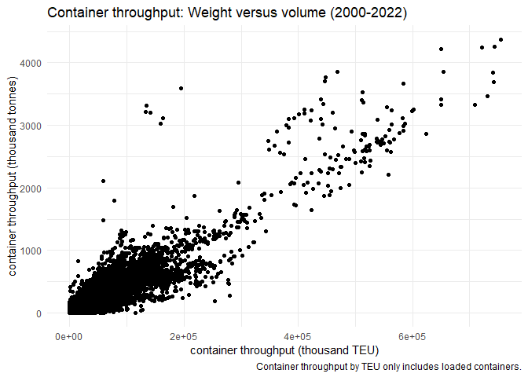
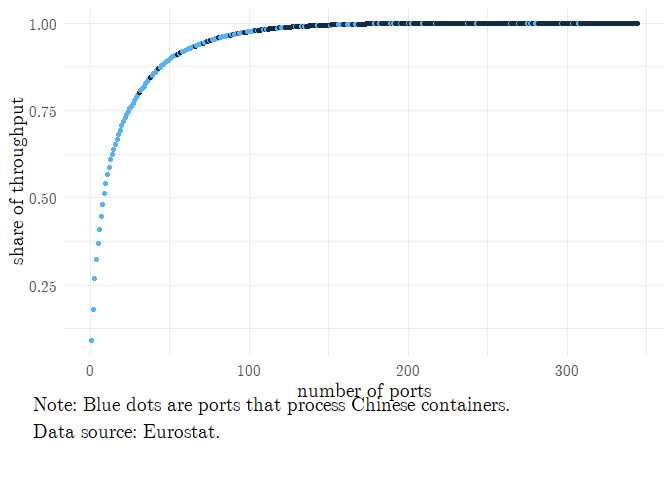
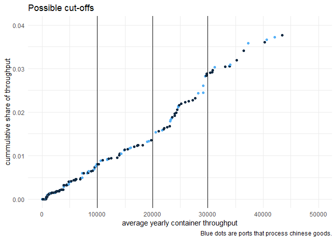
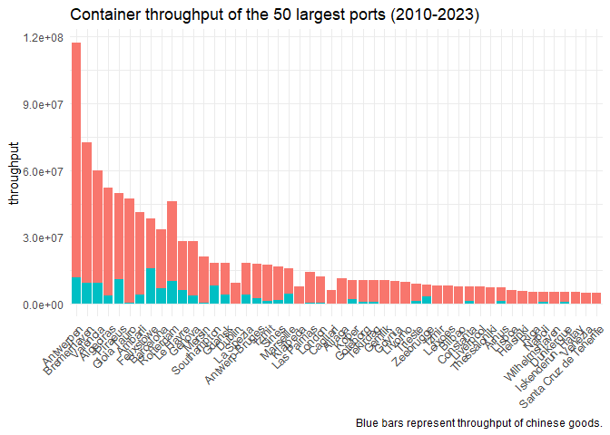
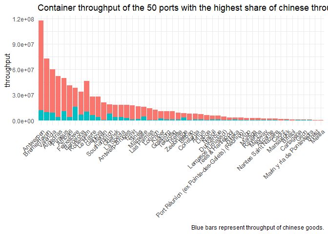
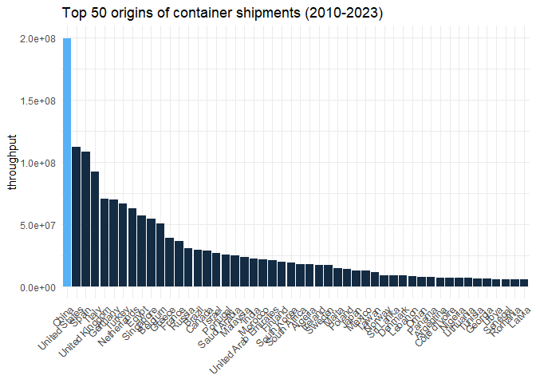
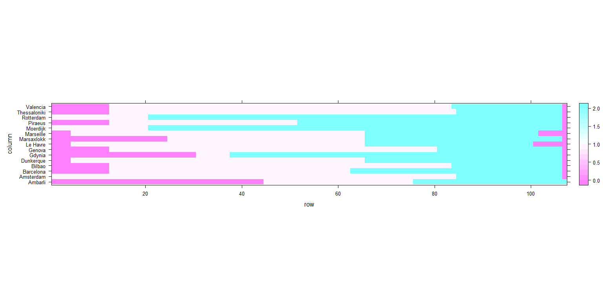
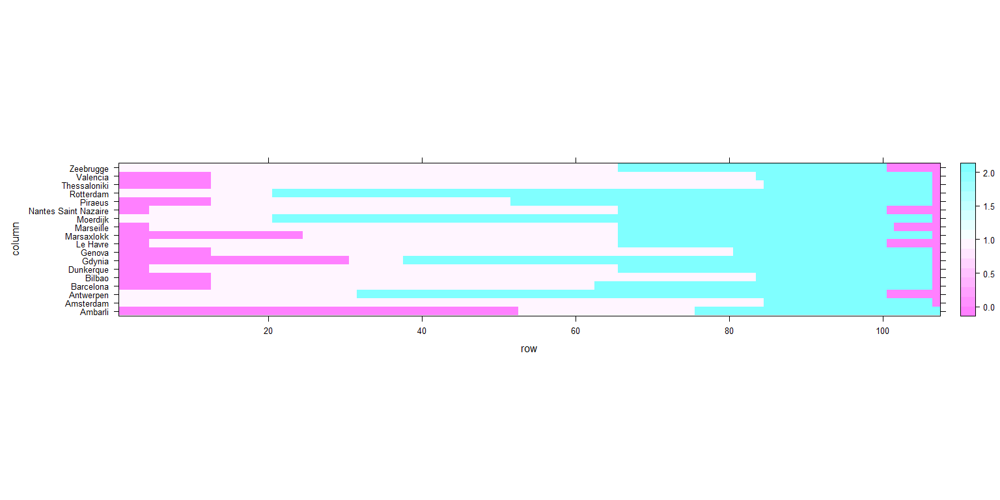

# What is the relevant sample? 

## Which type of cargo?

Most throughput of energy commodities (transported in bulks) and Ro-Ro comes from countries other than China. The highest share of Chinese products is shipped with container cargo. Therefore, the sample is restricted to container cargo only.

<!-- -->

## Container weight versus volume 

<!-- -->

Container processing can be measured with two variables: Container weight or volume (TEU). Above graph shows, that the relation between the two is mostly linear. To make the results of our analysis more comparable to other studies and data sources, we will proceed using data on container TEUs. 

## Which ports are relevant? 

Most of the throughput concentrates in a few hundred ports. Limiting the sample to 129 ports that are responsible for 99 percent of the container shipments might be a sensible option (65 of these are aggregates of ports). Additionally, not all ports process Chinese goods. While all major ports do, especially small ports usually do not. 

<!-- -->

An alternative to filtering by the aggregated throughput could be filtering by the average throughput. The graph below display the cumulative total throughput relative to the average yearly throughput. The graph indicates that possible cut-off thresholds of 10, 20, and 30 thousand TEUs of yearly average container throughput are associated with a loss of 0.8, 1.4, and 2.9 percent of the cumulative total container throughput. In the following, the sample is constructed by applying a threshold of 20 thousand TEUs of average yearly container throughput.  

<!-- -->

# Sample

## Descriptives

The statistical units in the Eurostat data are a mixed list of actual ports and grouped ports (statistical ports) and geographic areas, which represent aggregates of many ports. While the port groups "usually" have one port management, this cannot be assumed for everyone. In addition, statistical ports that represent a group of ports make up the majority of the container shipments (51.3 percent). The definition of the statistical units (statistical ports and geographic aggregates) can be found in the [metadata](https://eur-lex.europa.eu/legal-content/EN/TXT/?uri=uriserv:OJ.L_.2018.180.01.0029.01.ENG&toc=OJ:L:2018:180:FULL), and in the [annex](https://ec.europa.eu/eurostat/cache/metadata/Annexes/mar_esms_an_2.xlsx). As of now, the sample is restricted to statistical ports (no geographic aggregates). The remaining sample includes:

- 26 reporting countries
- 139 ports 
- 194 origin countries
- 26 years (1997-2023, covering 107 quarters)

## Distribution of throughput by ports and origin

Port that process a relatively high share of cargo from China are generally large ports. Below are displayed the top 50 largest ports, their aggregate throughput and their throughput of Chinese container shipments (Mainland China + Hong Kong). The other graph displays the top 50 ports with the highest share of Chinese container throughput. Both lists are rather similar with 18 large ports which are not among the top 50 ports with high Chinese container throughput. 

<!-- --><!-- -->

Above graphs indicate that the share of Chinese cargo is (surprisingly) low. The graph below plots the total container shipments from China, the total container shipments from origins other than China and the share of Chinese containers in percent. Recent global crises, like the financial crisis in 2007-2009, the corona-pandemic in 2020, and the Ukraine war in 2023 have led to drops in total cargo shipments. Interestingly, despite the narrative of the ever increasing dependency on Chinese goods, the share of Chinese container shipments is on a declining path since 2012. 

<!-- -->

<!-- -->

## Chinese ownership treatment

Originally, we found 26 ports which were at some point at least partly owned by a Chinese company. The selected sample contains 18 treated ports. Eight ports dropped out of the sample due to various reasons:

- One port does not report any data (Willebroek)
- One falls into an aggregate of many ports (Venlo, is included in an aggregate of 96 ports)
- One falls below the average throughput threshold of 20 million TEUs (Stockholm)
- Four ports were always treated (Duisburg, Felixtowe, Thamesport, Harwich)
- On is excluded due to being treated only very recently (Hamburg)

The following graph display all 18 treated ports and their annual container throughput as a share of their mean container throughput. The vertical lines indicate treatment time. Solid line represent the container throughput of the respective port. The dashed line represents the average throughput of the control group. Note that not all ports report the throughput for every period. This might influence the average.

<!-- -->

## Data availability for treated ports

The DiD approach is sensible to missing data in the timeseries of treated units. In the best case, there are no missing values in each treated unit. There are two options to achieve this: First, trim the time horizon at the front an end to make sure all treated ports start and end at the same time. Second, missing values in the middle of the time series could be imputed. 

<!-- -->

