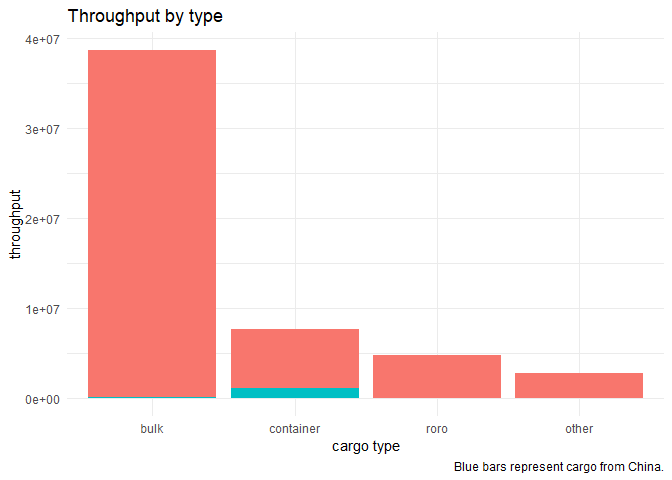
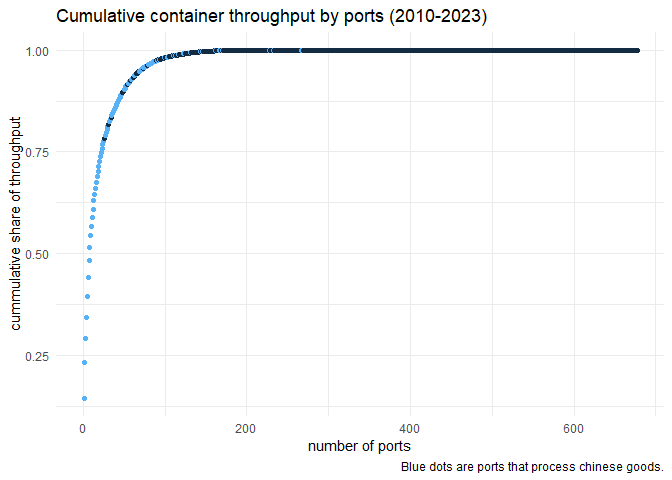
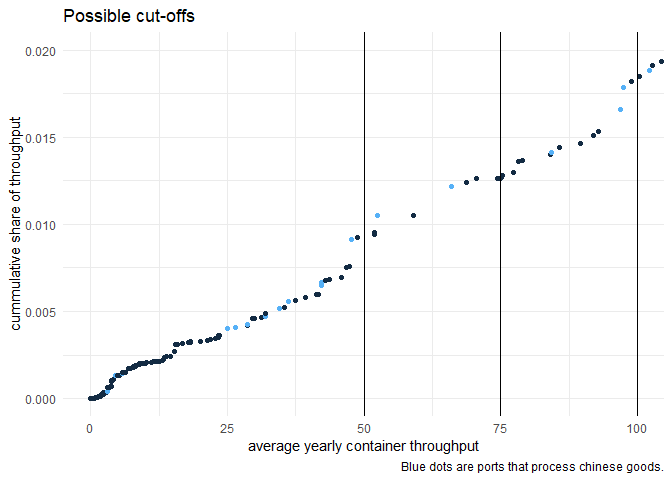
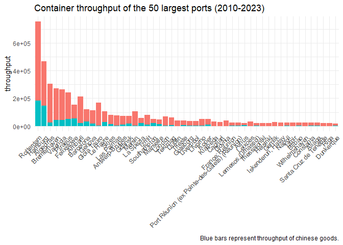
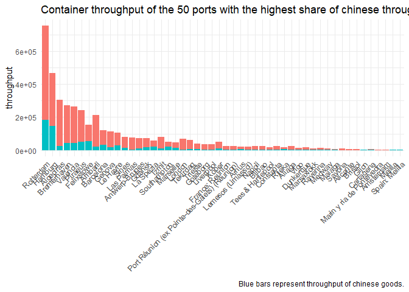
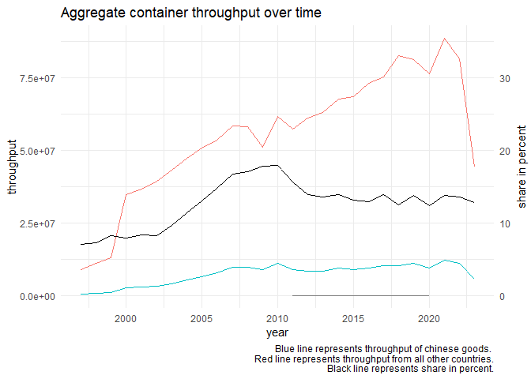
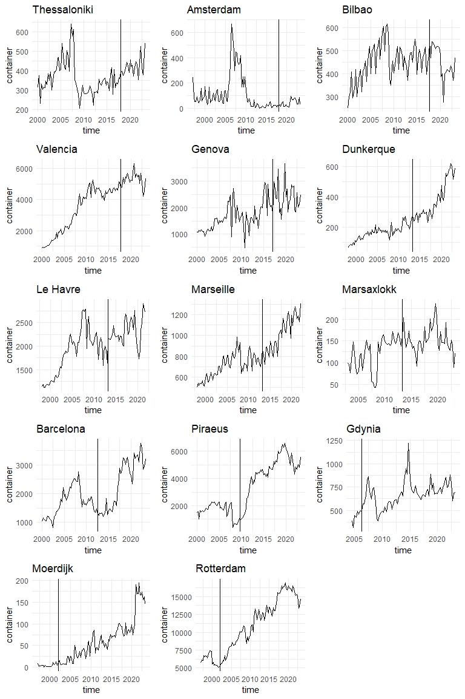

# What is the relevant sample? 

## Which type of cargo?

Most throughput of energy commodities (transported in bulks) and Ro-Ro comes from countries other than China. The highest share of Chinese products is shipped with container cargo. Therefore, the sample is restricted to container cargo only.

<!-- -->

## Which ports are relevant? 

Most of the throughput concentrates in a few hundred ports. Limiting the sample to 121 ports that are responsible for 99 percent of the container shipments might be a sensible option (61 of these are aggregates of ports). Additionally, not all ports process Chinese goods. While all major ports do, especially small ports usually do not. 

<!-- -->

An alternative to filtering by the aggregated throughput could be filtering by the average throughput. The two graphs below display the cumulative total throughput relative to the average yearly throughput. The second graph indicates that possible cut-off thresholds of 50, 75, and 100 thousand to tonnes of yearly average container throughput are associated with a loss of 0.9, 1.3, and 1.8 percent of the cumulative total container throughput. In the following, the sample is constructed by applying a threshold of 100 thousand tonnes of average yearly container throughput.  

<!-- -->

# Sample

## Descriptives

The statistical units in the Eurostat data are a mixed list of actual ports and grouped ports (statistical ports) and geographic areas, which represent aggregates of many ports. While the port groups "usually" have one port management, this cannot be assumed for everyone. In addition, statistical ports that represent a group of ports make up the majority of the container shipments (64.8 percent). The definition of the statistical units (statistical ports and geographic aggregates) can be found in the [metadata](https://eur-lex.europa.eu/legal-content/EN/TXT/?uri=uriserv:OJ.L_.2018.180.01.0029.01.ENG&toc=OJ:L:2018:180:FULL), and in the [annex](https://ec.europa.eu/eurostat/cache/metadata/Annexes/mar_esms_an_2.xlsx). As of now, the sample is restricted to statistical ports (no geographic aggregates). The remaining sample includes:

- 26 reporting countries
- 120 ports (only 0 with zero throughput)
- 190 origin countries
- 107 time periods (quarters)

## Distribution of throughput by ports and origin

Port that process a relatively high share of cargo from China are generally large ports. Below are displayed the top 50 largest ports, their aggregate throughput and their throughput of Chinese container shipments (Mainland China + Hong Kong). The other graph displays the top 50 ports with the highest share of Chinese container throughput. Both lists are quite similar with 16 large ports which are not among the top 50 ports with high Chinese container throughput. 

<!-- --><!-- -->

Above graphs indicate that the share of Chinese cargo is (surprisingly) low. The graph below plots the total cargo from China, the total cargo from origins other than China and the share of Chinese cargo in percent. Recent global crises, like the financial crisis in 2007-2009, the corona-pandemic in 2020, and the Ukraine war in 2023 have led to drops in total cargo shipments. Interestingly, they have affected Chinese cargo more than cargo from other origins, as the relative share of Chinese cargo mimics the movement of the total cargo shipments.

<!-- -->

<!-- -->

## Chinese ownership treatment

Originally, we found 26 ports which were at some point at least partly owned by a Chinese company. The selected sample contains 14 treated ports. Ten ports dropped out of the sample due to various reasons:

- (list them here)

<!-- -->

