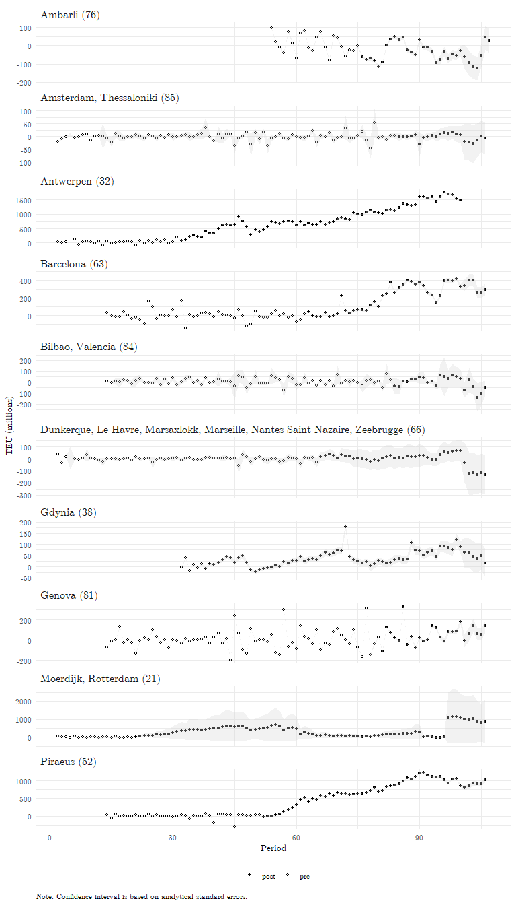

# Baseline equation (fixed effects)

In the first attempt, a simple fixed effects model and aggregated data on container throughput is used to identify the effect of Chinese port ownership. The effect of chinese ownership is included in form of a dummy variable (ChineseControl_it) that is set to one when the ownership (at least partly) transfered to a Chinese company (needs clarification).

$Thrpt_{it}=\alpha_{i}+\gamma_{t}+ChineseOwnership_{it}+e_{it}$ \left (1)

Second, we leverage the bilateral structure of the data, and use the variation between sender country and receiving port over time. The advantage of this approach is, that we can use higher levels of fixed effects, which enable much more precise control over which variation is used to identify the treatment effect. We proceed by estimating multipe equations with different levels of fixed effects with increasing restrictiveness.

$Thrpt_{ijt}=\alpha_{i}+\beta_{j}+\gamma_{t}+ChineseOwnership_{it}+ChineseOwnership_{it}*ChineseOrigin_{ij}+e_{ijt}$ \left (2)

In equation (1), the quarterly ($t$) container throughput ($Thrpt$) is explained by a set of port fixed-effects ($\alpha_{i}$), sender country fixed effects (\beta_{j}), and time fixed effects (\gamma_{t}). This specification controls for all time-invariant port-specific, and all time-invariant sender-specific unobserved covariates. The time fixed effects account for common shocks that affect all European ports equally.  

$Thrpt_{ijt}=\alpha_{ij}+\gamma_{t}+ChineseOwnership_{it}+ChineseOwnership_{it}*ChineseOrigin_{ij}+e_{ijt}$ \left (3)

Equation (2) increases the restrictiveness of th fixed effects by replacing the port-level fixed effects with port-sender fixed effects. This set of fixed effects controls for all time-invariant sender-port specfic covariates like regular shipping routes and preferences. This setup is often referred to as a difference-in-differences (DiD) set-up, as in the two-period case, equation (2) estimates a standard DiD effect. However, recent studies have shown, that this similarity does not extend to the multi-period case. 

$Thrpt_{ijt}=\alpha_{ij}+\beta_{jt}++ChineseOwnership_{it}+ChineseOwnership_{it}*ChineseOrigin_{ij}+e_{ijt}$ \left (4)

Equation (3) adds another dimension to the fixed effects. In addition to controlling for sender-port time-invariant covariates, it also controls for sender-time fixed effects. These encapsule all sender-time varying covariates like production shocks or supply shortages (as in the case of the blocked Suez Canal in 2021).

$Thrpt_{ijt}=\alpha_{ij}+\beta_{jt}++ChineseOwnership_{it}+ChineseOwnership_{it}*ChineseOrigin_{ij}+ChineseOperation_{it}+e_{ijt}$ \left (5)

Lastly, we add another Dummy variable $ChineseOperation_{it}$, which indicates whether a Chinese company is involved in the operation of the port or whether it just holds equity shares. 


```{=html}
<div id="jwfpsyznlw" style="padding-left:0px;padding-right:0px;padding-top:10px;padding-bottom:10px;overflow-x:auto;overflow-y:auto;width:auto;height:auto;">
<style>#jwfpsyznlw table {
  font-family: system-ui, 'Segoe UI', Roboto, Helvetica, Arial, sans-serif, 'Apple Color Emoji', 'Segoe UI Emoji', 'Segoe UI Symbol', 'Noto Color Emoji';
  -webkit-font-smoothing: antialiased;
  -moz-osx-font-smoothing: grayscale;
}

#jwfpsyznlw thead, #jwfpsyznlw tbody, #jwfpsyznlw tfoot, #jwfpsyznlw tr, #jwfpsyznlw td, #jwfpsyznlw th {
  border-style: none;
}

#jwfpsyznlw p {
  margin: 0;
  padding: 0;
}

#jwfpsyznlw .gt_table {
  display: table;
  border-collapse: collapse;
  line-height: normal;
  margin-left: auto;
  margin-right: auto;
  color: #333333;
  font-size: 16px;
  font-weight: normal;
  font-style: normal;
  background-color: #FFFFFF;
  width: auto;
  border-top-style: solid;
  border-top-width: 2px;
  border-top-color: #A8A8A8;
  border-right-style: none;
  border-right-width: 2px;
  border-right-color: #D3D3D3;
  border-bottom-style: solid;
  border-bottom-width: 2px;
  border-bottom-color: #A8A8A8;
  border-left-style: none;
  border-left-width: 2px;
  border-left-color: #D3D3D3;
}

#jwfpsyznlw .gt_caption {
  padding-top: 4px;
  padding-bottom: 4px;
}

#jwfpsyznlw .gt_title {
  color: #333333;
  font-size: 125%;
  font-weight: initial;
  padding-top: 4px;
  padding-bottom: 4px;
  padding-left: 5px;
  padding-right: 5px;
  border-bottom-color: #FFFFFF;
  border-bottom-width: 0;
}

#jwfpsyznlw .gt_subtitle {
  color: #333333;
  font-size: 85%;
  font-weight: initial;
  padding-top: 3px;
  padding-bottom: 5px;
  padding-left: 5px;
  padding-right: 5px;
  border-top-color: #FFFFFF;
  border-top-width: 0;
}

#jwfpsyznlw .gt_heading {
  background-color: #FFFFFF;
  text-align: center;
  border-bottom-color: #FFFFFF;
  border-left-style: none;
  border-left-width: 1px;
  border-left-color: #D3D3D3;
  border-right-style: none;
  border-right-width: 1px;
  border-right-color: #D3D3D3;
}

#jwfpsyznlw .gt_bottom_border {
  border-bottom-style: solid;
  border-bottom-width: 2px;
  border-bottom-color: #D3D3D3;
}

#jwfpsyznlw .gt_col_headings {
  border-top-style: solid;
  border-top-width: 2px;
  border-top-color: #D3D3D3;
  border-bottom-style: solid;
  border-bottom-width: 2px;
  border-bottom-color: #D3D3D3;
  border-left-style: none;
  border-left-width: 1px;
  border-left-color: #D3D3D3;
  border-right-style: none;
  border-right-width: 1px;
  border-right-color: #D3D3D3;
}

#jwfpsyznlw .gt_col_heading {
  color: #333333;
  background-color: #FFFFFF;
  font-size: 100%;
  font-weight: normal;
  text-transform: inherit;
  border-left-style: none;
  border-left-width: 1px;
  border-left-color: #D3D3D3;
  border-right-style: none;
  border-right-width: 1px;
  border-right-color: #D3D3D3;
  vertical-align: bottom;
  padding-top: 5px;
  padding-bottom: 6px;
  padding-left: 5px;
  padding-right: 5px;
  overflow-x: hidden;
}

#jwfpsyznlw .gt_column_spanner_outer {
  color: #333333;
  background-color: #FFFFFF;
  font-size: 100%;
  font-weight: normal;
  text-transform: inherit;
  padding-top: 0;
  padding-bottom: 0;
  padding-left: 4px;
  padding-right: 4px;
}

#jwfpsyznlw .gt_column_spanner_outer:first-child {
  padding-left: 0;
}

#jwfpsyznlw .gt_column_spanner_outer:last-child {
  padding-right: 0;
}

#jwfpsyznlw .gt_column_spanner {
  border-bottom-style: solid;
  border-bottom-width: 2px;
  border-bottom-color: #D3D3D3;
  vertical-align: bottom;
  padding-top: 5px;
  padding-bottom: 5px;
  overflow-x: hidden;
  display: inline-block;
  width: 100%;
}

#jwfpsyznlw .gt_spanner_row {
  border-bottom-style: hidden;
}

#jwfpsyznlw .gt_group_heading {
  padding-top: 0px;
  padding-bottom: 0px;
  padding-left: 5px;
  padding-right: 5px;
  color: #333333;
  background-color: #FFFFFF;
  font-size: 100%;
  font-weight: initial;
  text-transform: inherit;
  border-top-style: solid;
  border-top-width: 2px;
  border-top-color: #D3D3D3;
  border-bottom-style: solid;
  border-bottom-width: 2px;
  border-bottom-color: rgba(255, 255, 255, 0);
  border-left-style: none;
  border-left-width: 1px;
  border-left-color: #D3D3D3;
  border-right-style: none;
  border-right-width: 1px;
  border-right-color: #D3D3D3;
  vertical-align: middle;
  text-align: left;
}

#jwfpsyznlw .gt_empty_group_heading {
  padding: 0.5px;
  color: #333333;
  background-color: #FFFFFF;
  font-size: 100%;
  font-weight: initial;
  border-top-style: solid;
  border-top-width: 2px;
  border-top-color: #D3D3D3;
  border-bottom-style: solid;
  border-bottom-width: 2px;
  border-bottom-color: rgba(255, 255, 255, 0);
  vertical-align: middle;
}

#jwfpsyznlw .gt_from_md > :first-child {
  margin-top: 0;
}

#jwfpsyznlw .gt_from_md > :last-child {
  margin-bottom: 0;
}

#jwfpsyznlw .gt_row {
  padding-top: 8px;
  padding-bottom: 8px;
  padding-left: 5px;
  padding-right: 5px;
  margin: 10px;
  border-top-style: solid;
  border-top-width: 1px;
  border-top-color: rgba(255, 255, 255, 0);
  border-left-style: none;
  border-left-width: 1px;
  border-left-color: #D3D3D3;
  border-right-style: none;
  border-right-width: 1px;
  border-right-color: #D3D3D3;
  vertical-align: middle;
  overflow-x: hidden;
}

#jwfpsyznlw .gt_stub {
  color: #333333;
  background-color: #FFFFFF;
  font-size: 100%;
  font-weight: initial;
  text-transform: inherit;
  border-right-style: solid;
  border-right-width: 0px;
  border-right-color: rgba(255, 255, 255, 0);
  padding-left: 5px;
  padding-right: 5px;
}

#jwfpsyznlw .gt_stub_row_group {
  color: #333333;
  background-color: #FFFFFF;
  font-size: 100%;
  font-weight: initial;
  text-transform: inherit;
  border-right-style: solid;
  border-right-width: 2px;
  border-right-color: #D3D3D3;
  padding-left: 5px;
  padding-right: 5px;
  vertical-align: top;
}

#jwfpsyznlw .gt_row_group_first td {
  border-top-width: 2px;
}

#jwfpsyznlw .gt_row_group_first th {
  border-top-width: 2px;
}

#jwfpsyznlw .gt_summary_row {
  color: #333333;
  background-color: #FFFFFF;
  text-transform: inherit;
  padding-top: 8px;
  padding-bottom: 8px;
  padding-left: 5px;
  padding-right: 5px;
}

#jwfpsyznlw .gt_first_summary_row {
  border-top-style: solid;
  border-top-color: #D3D3D3;
}

#jwfpsyznlw .gt_first_summary_row.thick {
  border-top-width: 2px;
}

#jwfpsyznlw .gt_last_summary_row {
  padding-top: 8px;
  padding-bottom: 8px;
  padding-left: 5px;
  padding-right: 5px;
  border-bottom-style: solid;
  border-bottom-width: 2px;
  border-bottom-color: #D3D3D3;
}

#jwfpsyznlw .gt_grand_summary_row {
  color: #333333;
  background-color: #FFFFFF;
  text-transform: inherit;
  padding-top: 8px;
  padding-bottom: 8px;
  padding-left: 5px;
  padding-right: 5px;
}

#jwfpsyznlw .gt_first_grand_summary_row {
  padding-top: 8px;
  padding-bottom: 8px;
  padding-left: 5px;
  padding-right: 5px;
  border-top-style: double;
  border-top-width: 6px;
  border-top-color: #D3D3D3;
}

#jwfpsyznlw .gt_last_grand_summary_row_top {
  padding-top: 8px;
  padding-bottom: 8px;
  padding-left: 5px;
  padding-right: 5px;
  border-bottom-style: double;
  border-bottom-width: 6px;
  border-bottom-color: #D3D3D3;
}

#jwfpsyznlw .gt_striped {
  background-color: rgba(128, 128, 128, 0.05);
}

#jwfpsyznlw .gt_table_body {
  border-top-style: solid;
  border-top-width: 2px;
  border-top-color: #D3D3D3;
  border-bottom-style: solid;
  border-bottom-width: 2px;
  border-bottom-color: #D3D3D3;
}

#jwfpsyznlw .gt_footnotes {
  color: #333333;
  background-color: #FFFFFF;
  border-bottom-style: none;
  border-bottom-width: 2px;
  border-bottom-color: #D3D3D3;
  border-left-style: none;
  border-left-width: 2px;
  border-left-color: #D3D3D3;
  border-right-style: none;
  border-right-width: 2px;
  border-right-color: #D3D3D3;
}

#jwfpsyznlw .gt_footnote {
  margin: 0px;
  font-size: 90%;
  padding-top: 4px;
  padding-bottom: 4px;
  padding-left: 5px;
  padding-right: 5px;
}

#jwfpsyznlw .gt_sourcenotes {
  color: #333333;
  background-color: #FFFFFF;
  border-bottom-style: none;
  border-bottom-width: 2px;
  border-bottom-color: #D3D3D3;
  border-left-style: none;
  border-left-width: 2px;
  border-left-color: #D3D3D3;
  border-right-style: none;
  border-right-width: 2px;
  border-right-color: #D3D3D3;
}

#jwfpsyznlw .gt_sourcenote {
  font-size: 90%;
  padding-top: 4px;
  padding-bottom: 4px;
  padding-left: 5px;
  padding-right: 5px;
}

#jwfpsyznlw .gt_left {
  text-align: left;
}

#jwfpsyznlw .gt_center {
  text-align: center;
}

#jwfpsyznlw .gt_right {
  text-align: right;
  font-variant-numeric: tabular-nums;
}

#jwfpsyznlw .gt_font_normal {
  font-weight: normal;
}

#jwfpsyznlw .gt_font_bold {
  font-weight: bold;
}

#jwfpsyznlw .gt_font_italic {
  font-style: italic;
}

#jwfpsyznlw .gt_super {
  font-size: 65%;
}

#jwfpsyznlw .gt_footnote_marks {
  font-size: 75%;
  vertical-align: 0.4em;
  position: initial;
}

#jwfpsyznlw .gt_asterisk {
  font-size: 100%;
  vertical-align: 0;
}

#jwfpsyznlw .gt_indent_1 {
  text-indent: 5px;
}

#jwfpsyznlw .gt_indent_2 {
  text-indent: 10px;
}

#jwfpsyznlw .gt_indent_3 {
  text-indent: 15px;
}

#jwfpsyznlw .gt_indent_4 {
  text-indent: 20px;
}

#jwfpsyznlw .gt_indent_5 {
  text-indent: 25px;
}
</style>
<table class="gt_table" data-quarto-disable-processing="false" data-quarto-bootstrap="false">
  <thead>
    <tr class="gt_heading">
      <td colspan="5" class="gt_heading gt_title gt_font_normal" style>Fixed effects estimation results</td>
    </tr>
    <tr class="gt_heading">
      <td colspan="5" class="gt_heading gt_subtitle gt_font_normal gt_bottom_border" style>Dependent variable: Total throughput in thousand TEU</td>
    </tr>
    <tr class="gt_col_headings">
      <th class="gt_col_heading gt_columns_bottom_border gt_left" rowspan="1" colspan="1" scope="col" id=""></th>
      <th class="gt_col_heading gt_columns_bottom_border gt_center" rowspan="1" colspan="1" scope="col" id="Eq. 1">Eq. 1</th>
      <th class="gt_col_heading gt_columns_bottom_border gt_center" rowspan="1" colspan="1" scope="col" id="Eq. 2">Eq. 2</th>
      <th class="gt_col_heading gt_columns_bottom_border gt_center" rowspan="1" colspan="1" scope="col" id="Eq. 3">Eq. 3</th>
      <th class="gt_col_heading gt_columns_bottom_border gt_center" rowspan="1" colspan="1" scope="col" id="Eq. 4">Eq. 4</th>
    </tr>
  </thead>
  <tbody class="gt_table_body">
    <tr class="gt_group_heading_row">
      <th colspan="5" class="gt_empty_group_heading" scope="colgroup" id=""></th>
    </tr>
    <tr class="gt_row_group_first"><th id="stub_1_1" scope="row" class="gt_row gt_left gt_stub">Ownership Chinese SOE</th>
<td headers="NA stub_1_1 spec1" class="gt_row gt_center">145,275.7* (71,169.4)</td>
<td headers="NA stub_1_1 spec2" class="gt_row gt_center">585.4 (1,441.9)</td>
<td headers="NA stub_1_1 spec3" class="gt_row gt_center">2,087.4*** (357.2)</td>
<td headers="NA stub_1_1 spec4" class="gt_row gt_center">1,108.8** (395.7)</td></tr>
    <tr><th id="stub_1_2" scope="row" class="gt_row gt_left gt_stub">Ownership Chinese SOE x Origin China</th>
<td headers="NA stub_1_2 spec1" class="gt_row gt_center">  </td>
<td headers="NA stub_1_2 spec2" class="gt_row gt_center">58,325.9. (33,689.4)</td>
<td headers="NA stub_1_2 spec3" class="gt_row gt_center">19,469.3. (10,820.8)</td>
<td headers="NA stub_1_2 spec4" class="gt_row gt_center">19,149.1. (10,641.1)</td></tr>
    <tr class="gt_group_heading_row">
      <th colspan="5" class="gt_group_heading" scope="colgroup" id="Fixed effects:">Fixed effects:</th>
    </tr>
    <tr class="gt_row_group_first"><th id="stub_1_3" scope="row" class="gt_row gt_left gt_stub">Port</th>
<td headers="Fixed effects: stub_1_3 spec1" class="gt_row gt_center">yes</td>
<td headers="Fixed effects: stub_1_3 spec2" class="gt_row gt_center">yes</td>
<td headers="Fixed effects: stub_1_3 spec3" class="gt_row gt_center"></td>
<td headers="Fixed effects: stub_1_3 spec4" class="gt_row gt_center"></td></tr>
    <tr><th id="stub_1_4" scope="row" class="gt_row gt_left gt_stub">Period</th>
<td headers="Fixed effects: stub_1_4 spec1" class="gt_row gt_center">yes</td>
<td headers="Fixed effects: stub_1_4 spec2" class="gt_row gt_center">yes</td>
<td headers="Fixed effects: stub_1_4 spec3" class="gt_row gt_center"></td>
<td headers="Fixed effects: stub_1_4 spec4" class="gt_row gt_center"></td></tr>
    <tr><th id="stub_1_5" scope="row" class="gt_row gt_left gt_stub">Reporter-Period</th>
<td headers="Fixed effects: stub_1_5 spec1" class="gt_row gt_center">yes</td>
<td headers="Fixed effects: stub_1_5 spec2" class="gt_row gt_center"></td>
<td headers="Fixed effects: stub_1_5 spec3" class="gt_row gt_center"></td>
<td headers="Fixed effects: stub_1_5 spec4" class="gt_row gt_center">yes</td></tr>
    <tr><th id="stub_1_6" scope="row" class="gt_row gt_left gt_stub">Partner</th>
<td headers="Fixed effects: stub_1_6 spec1" class="gt_row gt_center"></td>
<td headers="Fixed effects: stub_1_6 spec2" class="gt_row gt_center">yes</td>
<td headers="Fixed effects: stub_1_6 spec3" class="gt_row gt_center"></td>
<td headers="Fixed effects: stub_1_6 spec4" class="gt_row gt_center"></td></tr>
    <tr><th id="stub_1_7" scope="row" class="gt_row gt_left gt_stub">Port-Partner</th>
<td headers="Fixed effects: stub_1_7 spec1" class="gt_row gt_center"></td>
<td headers="Fixed effects: stub_1_7 spec2" class="gt_row gt_center"></td>
<td headers="Fixed effects: stub_1_7 spec3" class="gt_row gt_center">yes</td>
<td headers="Fixed effects: stub_1_7 spec4" class="gt_row gt_center">yes</td></tr>
    <tr><th id="stub_1_8" scope="row" class="gt_row gt_left gt_stub">Partner-Period</th>
<td headers="Fixed effects: stub_1_8 spec1" class="gt_row gt_center"></td>
<td headers="Fixed effects: stub_1_8 spec2" class="gt_row gt_center"></td>
<td headers="Fixed effects: stub_1_8 spec3" class="gt_row gt_center">yes</td>
<td headers="Fixed effects: stub_1_8 spec4" class="gt_row gt_center">yes</td></tr>
    <tr class="gt_group_heading_row">
      <th colspan="5" class="gt_group_heading" scope="colgroup" id="Diagnostics:">Diagnostics:</th>
    </tr>
    <tr class="gt_row_group_first"><th id="stub_1_9" scope="row" class="gt_row gt_left gt_stub">S.E.: Clustered</th>
<td headers="Diagnostics: stub_1_9 spec1" class="gt_row gt_center">by: Port &amp; Period</td>
<td headers="Diagnostics: stub_1_9 spec2" class="gt_row gt_center">by: Port. &amp; Part.</td>
<td headers="Diagnostics: stub_1_9 spec3" class="gt_row gt_center">by: Port. &amp; Part.</td>
<td headers="Diagnostics: stub_1_9 spec4" class="gt_row gt_center">by: Port. &amp; Part.</td></tr>
    <tr><th id="stub_1_10" scope="row" class="gt_row gt_left gt_stub">Observations</th>
<td headers="Diagnostics: stub_1_10 spec1" class="gt_row gt_center">11,906</td>
<td headers="Diagnostics: stub_1_10 spec2" class="gt_row gt_center">388,820</td>
<td headers="Diagnostics: stub_1_10 spec3" class="gt_row gt_center">388,820</td>
<td headers="Diagnostics: stub_1_10 spec4" class="gt_row gt_center">388,820</td></tr>
    <tr><th id="stub_1_11" scope="row" class="gt_row gt_left gt_stub">R2</th>
<td headers="Diagnostics: stub_1_11 spec1" class="gt_row gt_center">0.91965</td>
<td headers="Diagnostics: stub_1_11 spec2" class="gt_row gt_center">0.23615</td>
<td headers="Diagnostics: stub_1_11 spec3" class="gt_row gt_center">0.80578</td>
<td headers="Diagnostics: stub_1_11 spec4" class="gt_row gt_center">0.81318</td></tr>
    <tr><th id="stub_1_12" scope="row" class="gt_row gt_left gt_stub">Within R2</th>
<td headers="Diagnostics: stub_1_12 spec1" class="gt_row gt_center">0.03251</td>
<td headers="Diagnostics: stub_1_12 spec2" class="gt_row gt_center">0.03665</td>
<td headers="Diagnostics: stub_1_12 spec3" class="gt_row gt_center">0.01082</td>
<td headers="Diagnostics: stub_1_12 spec4" class="gt_row gt_center">0.00719</td></tr>
  </tbody>
  
  
</table>
</div>
```

While the fixed effects identification strategy presented above is a common one in the literature, many authors criticize the model fo its lack of interpretable results. In particular, it is often unclear how the coefficients in fixed effects models are obtained and which units have served as comparisons to treated units, especially when the treatment timing varies between units. @Chaisemartin.2020 and @Borusyak.2022 find that the treatment effect estimated by two-way fixed effects models (as in equation (2)) is a weighted average of time-specific treatment effects with some weights potentially being negative. In extreme cases, this can cause negative coefficients although all time-specific treatment effects are positive. @GoodmanBacon.2021 point out that the estimator can be seen as a weighted average of all possible comparisons between treated, untreated, and not-yet-treated units, with the weights depending on treatment timing and the number of observations and conclude that a fixed effects set should be avoided, when the treatment effect is likely to vary over time.  

Another common issue is finding reasonable counterfactuals when interpreting the coefficients from fixed effects models. @Mummolo.2018 notes that researchers tend to present unrealistic counterfactuals when using fixed effects regression. Since fixed effect models only use a fraction of the variance to estimate the coefficients, interpreting the model with counterfactuals that are drawn from the original distribution of the data often leads to unrealistically high effects that sometimes falsely imply economically relevant effect sizes. Additionally, the major benefit of fixed effects, the ability to control for unobserved covariates, critically depends on the linear additive assumption [@Imai.2021]. In cases where the variation can be attributed to several dimensions of fixed effects, the estimator is undefined [@Kropko.2020].


# Difference in Differences

To address these shortcomings, we use recent advances in the DiD literature, and employ a staggered DiD estimator by @Callaway.2021. They formulate a unified approach to estimating average treatment effects in a DiD framework with multiple periods and varying treatment timing that avoids all above described interpretation issues. They define group-time average treatment effects, which measure the average treatment effect for a group of units that receive the treatment at the same point in time. In a later step, these group-time average treatment effects can be aggregated either by time period or group to derive an overall average treatment effect. Another advantage of their approach is that it gives the research the liberty to choose which comparison group should be used to calculate the treatment effects. That is, whether the comparison group includes only never-treated or not-yet-treated units. This translates to two parallel trend assumptions. When the comparison group is made up of never treated units:

$E[Y_{t}(0)-Y_{t-1}(0)|G=g]=E[Y_{t}(0)-Y_{t-1}(0)|C=1]$ 
with $g\leq t$ \left (6)

Where $Y_{t}(0)$ denotes the potential untreated outcome in period t, $G$ indicates the period a unit is first treated, and $C$ is an indicator that takes the value of one if a unit is never treated. Hence, the first term of the equation above denotes the difference between untreated outcomes of period t and period t-1 for units while they are treated, and the second term denotes the difference between potential outcomes of periods t and t-1 for units that are never treated. In a setting with staggered treatment, random sampling, and not treatment anticipation, the above parallel trend assumption leads the following group-time average treatment effects: 

$ATT(g,t)=E[Y_{t}(g)-Y_{t}(0)|G=g]=E[Y_{t}-Y_{g-1}|G=g]-E[Y_{t}-Y_{g-1}|C=1]$ \left (7)

Where $Y_{t}(g)$ denotes the treated outcome in period $t$, $Y_{t}$ denotes the observed outcome in period $t$. Hence, the average $ATT(g,t)$ represents the average effect of treatment in period t for units that are first treated in period g. To derive at an overall average treatment effect, we use a simple aggregation scheme as proposed by @Callaway.2021, which weights each ATT by the size of the group. 


```{=html}
<div id="zemewbohcg" style="padding-left:0px;padding-right:0px;padding-top:10px;padding-bottom:10px;overflow-x:auto;overflow-y:auto;width:auto;height:auto;">
<style>#zemewbohcg table {
  font-family: system-ui, 'Segoe UI', Roboto, Helvetica, Arial, sans-serif, 'Apple Color Emoji', 'Segoe UI Emoji', 'Segoe UI Symbol', 'Noto Color Emoji';
  -webkit-font-smoothing: antialiased;
  -moz-osx-font-smoothing: grayscale;
}

#zemewbohcg thead, #zemewbohcg tbody, #zemewbohcg tfoot, #zemewbohcg tr, #zemewbohcg td, #zemewbohcg th {
  border-style: none;
}

#zemewbohcg p {
  margin: 0;
  padding: 0;
}

#zemewbohcg .gt_table {
  display: table;
  border-collapse: collapse;
  line-height: normal;
  margin-left: auto;
  margin-right: auto;
  color: #333333;
  font-size: 16px;
  font-weight: normal;
  font-style: normal;
  background-color: #FFFFFF;
  width: auto;
  border-top-style: solid;
  border-top-width: 2px;
  border-top-color: #A8A8A8;
  border-right-style: none;
  border-right-width: 2px;
  border-right-color: #D3D3D3;
  border-bottom-style: solid;
  border-bottom-width: 2px;
  border-bottom-color: #A8A8A8;
  border-left-style: none;
  border-left-width: 2px;
  border-left-color: #D3D3D3;
}

#zemewbohcg .gt_caption {
  padding-top: 4px;
  padding-bottom: 4px;
}

#zemewbohcg .gt_title {
  color: #333333;
  font-size: 125%;
  font-weight: initial;
  padding-top: 4px;
  padding-bottom: 4px;
  padding-left: 5px;
  padding-right: 5px;
  border-bottom-color: #FFFFFF;
  border-bottom-width: 0;
}

#zemewbohcg .gt_subtitle {
  color: #333333;
  font-size: 85%;
  font-weight: initial;
  padding-top: 3px;
  padding-bottom: 5px;
  padding-left: 5px;
  padding-right: 5px;
  border-top-color: #FFFFFF;
  border-top-width: 0;
}

#zemewbohcg .gt_heading {
  background-color: #FFFFFF;
  text-align: center;
  border-bottom-color: #FFFFFF;
  border-left-style: none;
  border-left-width: 1px;
  border-left-color: #D3D3D3;
  border-right-style: none;
  border-right-width: 1px;
  border-right-color: #D3D3D3;
}

#zemewbohcg .gt_bottom_border {
  border-bottom-style: solid;
  border-bottom-width: 2px;
  border-bottom-color: #D3D3D3;
}

#zemewbohcg .gt_col_headings {
  border-top-style: solid;
  border-top-width: 2px;
  border-top-color: #D3D3D3;
  border-bottom-style: solid;
  border-bottom-width: 2px;
  border-bottom-color: #D3D3D3;
  border-left-style: none;
  border-left-width: 1px;
  border-left-color: #D3D3D3;
  border-right-style: none;
  border-right-width: 1px;
  border-right-color: #D3D3D3;
}

#zemewbohcg .gt_col_heading {
  color: #333333;
  background-color: #FFFFFF;
  font-size: 100%;
  font-weight: normal;
  text-transform: inherit;
  border-left-style: none;
  border-left-width: 1px;
  border-left-color: #D3D3D3;
  border-right-style: none;
  border-right-width: 1px;
  border-right-color: #D3D3D3;
  vertical-align: bottom;
  padding-top: 5px;
  padding-bottom: 6px;
  padding-left: 5px;
  padding-right: 5px;
  overflow-x: hidden;
}

#zemewbohcg .gt_column_spanner_outer {
  color: #333333;
  background-color: #FFFFFF;
  font-size: 100%;
  font-weight: normal;
  text-transform: inherit;
  padding-top: 0;
  padding-bottom: 0;
  padding-left: 4px;
  padding-right: 4px;
}

#zemewbohcg .gt_column_spanner_outer:first-child {
  padding-left: 0;
}

#zemewbohcg .gt_column_spanner_outer:last-child {
  padding-right: 0;
}

#zemewbohcg .gt_column_spanner {
  border-bottom-style: solid;
  border-bottom-width: 2px;
  border-bottom-color: #D3D3D3;
  vertical-align: bottom;
  padding-top: 5px;
  padding-bottom: 5px;
  overflow-x: hidden;
  display: inline-block;
  width: 100%;
}

#zemewbohcg .gt_spanner_row {
  border-bottom-style: hidden;
}

#zemewbohcg .gt_group_heading {
  padding-top: 8px;
  padding-bottom: 8px;
  padding-left: 5px;
  padding-right: 5px;
  color: #333333;
  background-color: #FFFFFF;
  font-size: 100%;
  font-weight: initial;
  text-transform: inherit;
  border-top-style: solid;
  border-top-width: 2px;
  border-top-color: #D3D3D3;
  border-bottom-style: solid;
  border-bottom-width: 2px;
  border-bottom-color: #D3D3D3;
  border-left-style: none;
  border-left-width: 1px;
  border-left-color: #D3D3D3;
  border-right-style: none;
  border-right-width: 1px;
  border-right-color: #D3D3D3;
  vertical-align: middle;
  text-align: left;
}

#zemewbohcg .gt_empty_group_heading {
  padding: 0.5px;
  color: #333333;
  background-color: #FFFFFF;
  font-size: 100%;
  font-weight: initial;
  border-top-style: solid;
  border-top-width: 2px;
  border-top-color: #D3D3D3;
  border-bottom-style: solid;
  border-bottom-width: 2px;
  border-bottom-color: #D3D3D3;
  vertical-align: middle;
}

#zemewbohcg .gt_from_md > :first-child {
  margin-top: 0;
}

#zemewbohcg .gt_from_md > :last-child {
  margin-bottom: 0;
}

#zemewbohcg .gt_row {
  padding-top: 8px;
  padding-bottom: 8px;
  padding-left: 5px;
  padding-right: 5px;
  margin: 10px;
  border-top-style: solid;
  border-top-width: 0px;
  border-top-color: #D3D3D3;
  border-left-style: none;
  border-left-width: 1px;
  border-left-color: #D3D3D3;
  border-right-style: none;
  border-right-width: 1px;
  border-right-color: #D3D3D3;
  vertical-align: middle;
  overflow-x: hidden;
}

#zemewbohcg .gt_stub {
  color: #333333;
  background-color: #FFFFFF;
  font-size: 100%;
  font-weight: initial;
  text-transform: inherit;
  border-right-style: solid;
  border-right-width: 0px;
  border-right-color: #D3D3D3;
  padding-left: 5px;
  padding-right: 5px;
}

#zemewbohcg .gt_stub_row_group {
  color: #333333;
  background-color: #FFFFFF;
  font-size: 100%;
  font-weight: initial;
  text-transform: inherit;
  border-right-style: solid;
  border-right-width: 2px;
  border-right-color: #D3D3D3;
  padding-left: 5px;
  padding-right: 5px;
  vertical-align: top;
}

#zemewbohcg .gt_row_group_first td {
  border-top-width: 2px;
}

#zemewbohcg .gt_row_group_first th {
  border-top-width: 2px;
}

#zemewbohcg .gt_summary_row {
  color: #333333;
  background-color: #FFFFFF;
  text-transform: inherit;
  padding-top: 8px;
  padding-bottom: 8px;
  padding-left: 5px;
  padding-right: 5px;
}

#zemewbohcg .gt_first_summary_row {
  border-top-style: solid;
  border-top-color: #D3D3D3;
}

#zemewbohcg .gt_first_summary_row.thick {
  border-top-width: 2px;
}

#zemewbohcg .gt_last_summary_row {
  padding-top: 8px;
  padding-bottom: 8px;
  padding-left: 5px;
  padding-right: 5px;
  border-bottom-style: solid;
  border-bottom-width: 2px;
  border-bottom-color: #D3D3D3;
}

#zemewbohcg .gt_grand_summary_row {
  color: #333333;
  background-color: #FFFFFF;
  text-transform: inherit;
  padding-top: 8px;
  padding-bottom: 8px;
  padding-left: 5px;
  padding-right: 5px;
}

#zemewbohcg .gt_first_grand_summary_row {
  padding-top: 8px;
  padding-bottom: 8px;
  padding-left: 5px;
  padding-right: 5px;
  border-top-style: double;
  border-top-width: 6px;
  border-top-color: #D3D3D3;
}

#zemewbohcg .gt_last_grand_summary_row_top {
  padding-top: 8px;
  padding-bottom: 8px;
  padding-left: 5px;
  padding-right: 5px;
  border-bottom-style: double;
  border-bottom-width: 6px;
  border-bottom-color: #D3D3D3;
}

#zemewbohcg .gt_striped {
  background-color: rgba(128, 128, 128, 0.05);
}

#zemewbohcg .gt_table_body {
  border-top-style: solid;
  border-top-width: 2px;
  border-top-color: #D3D3D3;
  border-bottom-style: solid;
  border-bottom-width: 2px;
  border-bottom-color: #D3D3D3;
}

#zemewbohcg .gt_footnotes {
  color: #333333;
  background-color: #FFFFFF;
  border-bottom-style: none;
  border-bottom-width: 2px;
  border-bottom-color: #D3D3D3;
  border-left-style: none;
  border-left-width: 2px;
  border-left-color: #D3D3D3;
  border-right-style: none;
  border-right-width: 2px;
  border-right-color: #D3D3D3;
}

#zemewbohcg .gt_footnote {
  margin: 0px;
  font-size: 90%;
  padding-top: 4px;
  padding-bottom: 4px;
  padding-left: 5px;
  padding-right: 5px;
}

#zemewbohcg .gt_sourcenotes {
  color: #333333;
  background-color: #FFFFFF;
  border-bottom-style: none;
  border-bottom-width: 2px;
  border-bottom-color: #D3D3D3;
  border-left-style: none;
  border-left-width: 2px;
  border-left-color: #D3D3D3;
  border-right-style: none;
  border-right-width: 2px;
  border-right-color: #D3D3D3;
}

#zemewbohcg .gt_sourcenote {
  font-size: 90%;
  padding-top: 4px;
  padding-bottom: 4px;
  padding-left: 5px;
  padding-right: 5px;
}

#zemewbohcg .gt_left {
  text-align: left;
}

#zemewbohcg .gt_center {
  text-align: center;
}

#zemewbohcg .gt_right {
  text-align: right;
  font-variant-numeric: tabular-nums;
}

#zemewbohcg .gt_font_normal {
  font-weight: normal;
}

#zemewbohcg .gt_font_bold {
  font-weight: bold;
}

#zemewbohcg .gt_font_italic {
  font-style: italic;
}

#zemewbohcg .gt_super {
  font-size: 65%;
}

#zemewbohcg .gt_footnote_marks {
  font-size: 75%;
  vertical-align: 0.4em;
  position: initial;
}

#zemewbohcg .gt_asterisk {
  font-size: 100%;
  vertical-align: 0;
}

#zemewbohcg .gt_indent_1 {
  text-indent: 5px;
}

#zemewbohcg .gt_indent_2 {
  text-indent: 10px;
}

#zemewbohcg .gt_indent_3 {
  text-indent: 15px;
}

#zemewbohcg .gt_indent_4 {
  text-indent: 20px;
}

#zemewbohcg .gt_indent_5 {
  text-indent: 25px;
}
</style>
<table class="gt_table" data-quarto-disable-processing="false" data-quarto-bootstrap="false">
  <thead>
    <tr class="gt_heading">
      <td colspan="7" class="gt_heading gt_title gt_font_normal" style>Aggregation of group time treatment effects</td>
    </tr>
    <tr class="gt_heading">
      <td colspan="7" class="gt_heading gt_subtitle gt_font_normal gt_bottom_border" style>Dependent variable: Total throughput in thousand TEU</td>
    </tr>
    <tr class="gt_col_headings gt_spanner_row">
      <th class="gt_col_heading gt_columns_bottom_border gt_left" rowspan="2" colspan="1" scope="col" id=""></th>
      <th class="gt_center gt_columns_top_border gt_column_spanner_outer" rowspan="1" colspan="4" scope="colgroup" id="Never treated">
        <span class="gt_column_spanner">Never treated</span>
      </th>
      <th class="gt_center gt_columns_top_border gt_column_spanner_outer" rowspan="1" colspan="2" scope="colgroup" id="Not yet treated">
        <span class="gt_column_spanner">Not yet treated</span>
      </th>
    </tr>
    <tr class="gt_col_headings">
      <th class="gt_col_heading gt_columns_bottom_border gt_right" rowspan="1" colspan="1" scope="col" id="unconditional">unconditional</th>
      <th class="gt_col_heading gt_columns_bottom_border gt_left" rowspan="1" colspan="1" scope="col" id="95% CI">95% CI</th>
      <th class="gt_col_heading gt_columns_bottom_border gt_right" rowspan="1" colspan="1" scope="col" id="conditional">conditional</th>
      <th class="gt_col_heading gt_columns_bottom_border gt_left" rowspan="1" colspan="1" scope="col" id="95% CI">95% CI</th>
      <th class="gt_col_heading gt_columns_bottom_border gt_right" rowspan="1" colspan="1" scope="col" id="conditional">conditional</th>
      <th class="gt_col_heading gt_columns_bottom_border gt_left" rowspan="1" colspan="1" scope="col" id="95% CI">95% CI</th>
    </tr>
  </thead>
  <tbody class="gt_table_body">
    <tr class="gt_group_heading_row">
      <th colspan="7" class="gt_empty_group_heading" scope="colgroup" id=""></th>
    </tr>
    <tr class="gt_row_group_first"><th id="stub_1_1" scope="row" class="gt_row gt_left gt_stub">simple average</th>
<td headers="NA stub_1_1 ATT" class="gt_row gt_right">104,244*</td>
<td headers="NA stub_1_1 Conf" class="gt_row gt_left">[64,728, 143,759]</td>
<td headers="NA stub_1_1 ATT_cond" class="gt_row gt_right">  27,699</td>
<td headers="NA stub_1_1 Conf_cond" class="gt_row gt_left">[-138,337; 193,735]</td>
<td headers="NA stub_1_1 ATT_cond_ny" class="gt_row gt_right">  22,785</td>
<td headers="NA stub_1_1 Conf_cond_ny" class="gt_row gt_left">[-199,944; 245,514]</td></tr>
    <tr class="gt_group_heading_row">
      <th colspan="7" class="gt_group_heading" scope="colgroup" id="by group:">by group:</th>
    </tr>
    <tr class="gt_row_group_first"><th id="stub_1_2" scope="row" class="gt_row gt_left gt_stub">Antwerpen</th>
<td headers="by group: stub_1_2 ATT" class="gt_row gt_right">606,664*</td>
<td headers="by group: stub_1_2 Conf" class="gt_row gt_left">[442,534, 770,794]</td>
<td headers="by group: stub_1_2 ATT_cond" class="gt_row gt_right"> 156,389</td>
<td headers="by group: stub_1_2 Conf_cond" class="gt_row gt_left">[-136,885; 449,663]</td>
<td headers="by group: stub_1_2 ATT_cond_ny" class="gt_row gt_right"> 121,518</td>
<td headers="by group: stub_1_2 Conf_cond_ny" class="gt_row gt_left">[-147,448; 390,485]</td></tr>
    <tr><th id="stub_1_3" scope="row" class="gt_row gt_left gt_stub">Zeebrugge</th>
<td headers="by group: stub_1_3 ATT" class="gt_row gt_right">-36,468</td>
<td headers="by group: stub_1_3 Conf" class="gt_row gt_left">[-198,329, 125,393]</td>
<td headers="by group: stub_1_3 ATT_cond" class="gt_row gt_right"> -39,977</td>
<td headers="by group: stub_1_3 Conf_cond" class="gt_row gt_left">[-141,664; 61,710]</td>
<td headers="by group: stub_1_3 ATT_cond_ny" class="gt_row gt_right"> -39,993</td>
<td headers="by group: stub_1_3 Conf_cond_ny" class="gt_row gt_left">[-120,491; 40,505]</td></tr>
    <tr><th id="stub_1_4" scope="row" class="gt_row gt_left gt_stub">Barcelona</th>
<td headers="by group: stub_1_4 ATT" class="gt_row gt_right"> 99,628</td>
<td headers="by group: stub_1_4 Conf" class="gt_row gt_left">[-28,506, 227,762]</td>
<td headers="by group: stub_1_4 ATT_cond" class="gt_row gt_right"> 100,465</td>
<td headers="by group: stub_1_4 Conf_cond" class="gt_row gt_left">[-44,678; 245,608]</td>
<td headers="by group: stub_1_4 ATT_cond_ny" class="gt_row gt_right">  99,497</td>
<td headers="by group: stub_1_4 Conf_cond_ny" class="gt_row gt_left">[-158,358; 357,352]</td></tr>
    <tr><th id="stub_1_5" scope="row" class="gt_row gt_left gt_stub">Bilbao</th>
<td headers="by group: stub_1_5 ATT" class="gt_row gt_right"> -4,194</td>
<td headers="by group: stub_1_5 Conf" class="gt_row gt_left">[-78,665, 70,278]</td>
<td headers="by group: stub_1_5 ATT_cond" class="gt_row gt_right">  -2,616</td>
<td headers="by group: stub_1_5 Conf_cond" class="gt_row gt_left">[-662,333; 657,101]</td>
<td headers="by group: stub_1_5 ATT_cond_ny" class="gt_row gt_right">  -2,609</td>
<td headers="by group: stub_1_5 Conf_cond_ny" class="gt_row gt_left">[-560,181; 554,963]</td></tr>
    <tr><th id="stub_1_6" scope="row" class="gt_row gt_left gt_stub">Valencia</th>
<td headers="by group: stub_1_6 ATT" class="gt_row gt_right"> 11,785</td>
<td headers="by group: stub_1_6 Conf" class="gt_row gt_left">[-49,952, 73,523]</td>
<td headers="by group: stub_1_6 ATT_cond" class="gt_row gt_right">   6,809</td>
<td headers="by group: stub_1_6 Conf_cond" class="gt_row gt_left">[-807,924; 821,542]</td>
<td headers="by group: stub_1_6 ATT_cond_ny" class="gt_row gt_right">   6,949</td>
<td headers="by group: stub_1_6 Conf_cond_ny" class="gt_row gt_left">[-643,695; 657,593]</td></tr>
    <tr><th id="stub_1_7" scope="row" class="gt_row gt_left gt_stub">Dunkerque</th>
<td headers="by group: stub_1_7 ATT" class="gt_row gt_right"> 10,006</td>
<td headers="by group: stub_1_7 Conf" class="gt_row gt_left">[-159,260, 179,271]</td>
<td headers="by group: stub_1_7 ATT_cond" class="gt_row gt_right">  10,856</td>
<td headers="by group: stub_1_7 Conf_cond" class="gt_row gt_left">[-72,201; 93,913]</td>
<td headers="by group: stub_1_7 ATT_cond_ny" class="gt_row gt_right">  10,807</td>
<td headers="by group: stub_1_7 Conf_cond_ny" class="gt_row gt_left">[-78,404; 100,018]</td></tr>
    <tr><th id="stub_1_8" scope="row" class="gt_row gt_left gt_stub">Le Havre</th>
<td headers="by group: stub_1_8 ATT" class="gt_row gt_right"> 61,118</td>
<td headers="by group: stub_1_8 Conf" class="gt_row gt_left">[-104,428, 226,663]</td>
<td headers="by group: stub_1_8 ATT_cond" class="gt_row gt_right">  39,079</td>
<td headers="by group: stub_1_8 Conf_cond" class="gt_row gt_left">[-102,452; 180,610]</td>
<td headers="by group: stub_1_8 ATT_cond_ny" class="gt_row gt_right">  39,017</td>
<td headers="by group: stub_1_8 Conf_cond_ny" class="gt_row gt_left">[-80,129; 158,162]</td></tr>
    <tr><th id="stub_1_9" scope="row" class="gt_row gt_left gt_stub">Marseille</th>
<td headers="by group: stub_1_9 ATT" class="gt_row gt_right"> 23,632</td>
<td headers="by group: stub_1_9 Conf" class="gt_row gt_left">[-103,008, 150,273]</td>
<td headers="by group: stub_1_9 ATT_cond" class="gt_row gt_right">  15,224</td>
<td headers="by group: stub_1_9 Conf_cond" class="gt_row gt_left">[-117,489; 147,937]</td>
<td headers="by group: stub_1_9 ATT_cond_ny" class="gt_row gt_right">  15,163</td>
<td headers="by group: stub_1_9 Conf_cond_ny" class="gt_row gt_left">[-125,151; 155,477]</td></tr>
    <tr><th id="stub_1_10" scope="row" class="gt_row gt_left gt_stub">Nantes Saint Nazaire</th>
<td headers="by group: stub_1_10 ATT" class="gt_row gt_right"> -8,967</td>
<td headers="by group: stub_1_10 Conf" class="gt_row gt_left">[-83,165, 65,232]</td>
<td headers="by group: stub_1_10 ATT_cond" class="gt_row gt_right"><br /></td>
<td headers="by group: stub_1_10 Conf_cond" class="gt_row gt_left">[NaN; NA]</td>
<td headers="by group: stub_1_10 ATT_cond_ny" class="gt_row gt_right"><br /></td>
<td headers="by group: stub_1_10 Conf_cond_ny" class="gt_row gt_left">[NaN; NA]</td></tr>
    <tr><th id="stub_1_11" scope="row" class="gt_row gt_left gt_stub">Piraeus</th>
<td headers="by group: stub_1_11 ATT" class="gt_row gt_right">411,876*</td>
<td headers="by group: stub_1_11 Conf" class="gt_row gt_left">[237,189, 586,563]</td>
<td headers="by group: stub_1_11 ATT_cond" class="gt_row gt_right"> 379,988</td>
<td headers="by group: stub_1_11 Conf_cond" class="gt_row gt_left">[-318,288; 1,078,264]</td>
<td headers="by group: stub_1_11 ATT_cond_ny" class="gt_row gt_right"> 383,286*</td>
<td headers="by group: stub_1_11 Conf_cond_ny" class="gt_row gt_left">[156,427; 610,145]</td></tr>
    <tr><th id="stub_1_12" scope="row" class="gt_row gt_left gt_stub">Thessaloniki</th>
<td headers="by group: stub_1_12 ATT" class="gt_row gt_right"> -2,696</td>
<td headers="by group: stub_1_12 Conf" class="gt_row gt_left">[-60,882, 55,490]</td>
<td headers="by group: stub_1_12 ATT_cond" class="gt_row gt_right">  -3,060</td>
<td headers="by group: stub_1_12 Conf_cond" class="gt_row gt_left">[-632,882; 626,761]</td>
<td headers="by group: stub_1_12 ATT_cond_ny" class="gt_row gt_right">  -3,060</td>
<td headers="by group: stub_1_12 Conf_cond_ny" class="gt_row gt_left">[-618,100; 611,979]</td></tr>
    <tr><th id="stub_1_13" scope="row" class="gt_row gt_left gt_stub">Genova</th>
<td headers="by group: stub_1_13 ATT" class="gt_row gt_right"> 16,112</td>
<td headers="by group: stub_1_13 Conf" class="gt_row gt_left">[-77,895, 110,119]</td>
<td headers="by group: stub_1_13 ATT_cond" class="gt_row gt_right">  11,033</td>
<td headers="by group: stub_1_13 Conf_cond" class="gt_row gt_left">[-108,051; 130,116]</td>
<td headers="by group: stub_1_13 ATT_cond_ny" class="gt_row gt_right">  10,227</td>
<td headers="by group: stub_1_13 Conf_cond_ny" class="gt_row gt_left">[-51,952; 72,405]</td></tr>
    <tr><th id="stub_1_14" scope="row" class="gt_row gt_left gt_stub">Marsaxlokk</th>
<td headers="by group: stub_1_14 ATT" class="gt_row gt_right">-10,547</td>
<td headers="by group: stub_1_14 Conf" class="gt_row gt_left">[-102,790, 81,695]</td>
<td headers="by group: stub_1_14 ATT_cond" class="gt_row gt_right"> -15,553</td>
<td headers="by group: stub_1_14 Conf_cond" class="gt_row gt_left">[-158,851; 127,745]</td>
<td headers="by group: stub_1_14 ATT_cond_ny" class="gt_row gt_right"> -15,685</td>
<td headers="by group: stub_1_14 Conf_cond_ny" class="gt_row gt_left">[-159,096; 127,726]</td></tr>
    <tr><th id="stub_1_15" scope="row" class="gt_row gt_left gt_stub">Amsterdam</th>
<td headers="by group: stub_1_15 ATT" class="gt_row gt_right">  1,101</td>
<td headers="by group: stub_1_15 Conf" class="gt_row gt_left">[-57,071, 59,272]</td>
<td headers="by group: stub_1_15 ATT_cond" class="gt_row gt_right">   1,606</td>
<td headers="by group: stub_1_15 Conf_cond" class="gt_row gt_left">[-1,025,085; 1,028,297]</td>
<td headers="by group: stub_1_15 ATT_cond_ny" class="gt_row gt_right">   1,606</td>
<td headers="by group: stub_1_15 Conf_cond_ny" class="gt_row gt_left">[-882,312; 885,524]</td></tr>
    <tr><th id="stub_1_16" scope="row" class="gt_row gt_left gt_stub">Moerdijk</th>
<td headers="by group: stub_1_16 ATT" class="gt_row gt_right"> -3,871</td>
<td headers="by group: stub_1_16 Conf" class="gt_row gt_left">[-62,743, 55,001]</td>
<td headers="by group: stub_1_16 ATT_cond" class="gt_row gt_right">  17,697</td>
<td headers="by group: stub_1_16 Conf_cond" class="gt_row gt_left">[-38,050; 73,444]</td>
<td headers="by group: stub_1_16 ATT_cond_ny" class="gt_row gt_right">  19,412</td>
<td headers="by group: stub_1_16 Conf_cond_ny" class="gt_row gt_left">[-27,898; 66,722]</td></tr>
    <tr><th id="stub_1_17" scope="row" class="gt_row gt_left gt_stub">Rotterdam</th>
<td headers="by group: stub_1_17 ATT" class="gt_row gt_right">562,379*</td>
<td headers="by group: stub_1_17 Conf" class="gt_row gt_left">[432,484, 692,273]</td>
<td headers="by group: stub_1_17 ATT_cond" class="gt_row gt_right">-224,856*</td>
<td headers="by group: stub_1_17 Conf_cond" class="gt_row gt_left">[-354,053; -95,659]</td>
<td headers="by group: stub_1_17 ATT_cond_ny" class="gt_row gt_right">-271,382*</td>
<td headers="by group: stub_1_17 Conf_cond_ny" class="gt_row gt_left">[-390,320; -152,444]</td></tr>
    <tr><th id="stub_1_18" scope="row" class="gt_row gt_left gt_stub">Gdynia</th>
<td headers="by group: stub_1_18 ATT" class="gt_row gt_right"> 40,451</td>
<td headers="by group: stub_1_18 Conf" class="gt_row gt_left">[-128,461, 209,364]</td>
<td headers="by group: stub_1_18 ATT_cond" class="gt_row gt_right">  62,085*</td>
<td headers="by group: stub_1_18 Conf_cond" class="gt_row gt_left">[75,342; 48,829]</td>
<td headers="by group: stub_1_18 ATT_cond_ny" class="gt_row gt_right">  65,674*</td>
<td headers="by group: stub_1_18 Conf_cond_ny" class="gt_row gt_left">[81,431; 49,917]</td></tr>
    <tr><th id="stub_1_19" scope="row" class="gt_row gt_left gt_stub">Ambarli</th>
<td headers="by group: stub_1_19 ATT" class="gt_row gt_right">-21,236</td>
<td headers="by group: stub_1_19 Conf" class="gt_row gt_left">[-91,352, 48,881]</td>
<td headers="by group: stub_1_19 ATT_cond" class="gt_row gt_right"> -34,469</td>
<td headers="by group: stub_1_19 Conf_cond" class="gt_row gt_left">[-114,149; 45,212]</td>
<td headers="by group: stub_1_19 ATT_cond_ny" class="gt_row gt_right"> -34,049</td>
<td headers="by group: stub_1_19 Conf_cond_ny" class="gt_row gt_left">[-110,074; 41,976]</td></tr>
  </tbody>
  
  <tfoot class="gt_footnotes">
    <tr>
      <td class="gt_footnote" colspan="7"> Stars indicate that the confidence interval does not include zero.</td>
    </tr>
  </tfoot>
</table>
</div>
```


One potential issue, that above DiD model may have is endogeneity. In particular, ports may be selected into treatment based on their throughput in the past. If that is the case, untreated units do not pose a credible comparison group to estimate treatment effects. To alleviate those concerns, we reestimate the treatment effects adding the not yet treated observations as the comparison group. Following @Callaway.2021, the underlying parallel trend assumption is then: 

$E[Y_{t}-Y_{t-1}|G=g]=E[Y_{t}-Y_{t-1}|D_{t}=0, G\neq g]$ with $g\leq t$ \left (8)

Where $D_{t}$ is an binary variable indicating whether a unit is treated in period t. The new parallel trend assumption then leads to the following group-time average treatment effects:

$ATT(g,t)=E[Y_{t}(g)-Y_{t}(0)|G=g]=E[Y_{t}-Y_{g-1}|G=g]-E[Y_{t}-Y_{g-1}|D_{t}=0, G\neq g]$ \left (9)

Hence $ATT(g,t)$ represents the average treatment effect of group $G$ in period $t$ in comparison to not yet treated units (and untreated units). 


# Parallel trend assumption
## Event study
For the DiD framework to deliver unbiased results, the parallel trend assumptions needs to hold. While it is not possible to test this assumption directly, we conduct a few test to validate whether the pre-treatment trends run parallel or not. The following graph displays and event study type aggregation of the group-time average treatment effects calculated above. The aggregated average treatment effects before treatment (red) are all around zero, indicating that parallel trends holds in the pre-treatment period. The graphs clearly indicate a persistent positive treatment effect after the treatment. The point-wise estimates are only significant in a couple of periods, which is due to the fact that some ports experience a high positive treatment effect while others do not. In particular *insert portnames* show consistently higher throughputs after treatment than the control group. 

<!-- -->


<!-- Due to the small number of treated ports, there exists the possibility that the treated ports are just coincidentally experiencing an increase in the throughput after treatment. To alleviate these concerns, we conduct a placebo test testing the sharp null of an average treatment effect of zero @Young.2019. We exclude all treated ports from the data and randomly assign 18 port to be treated at a random point in time and calculate the simple average treatment effect. Repeating this process for 100 times yields the empirical distribution of treatment effects depicted in the bar chart below. As expected, the distribution is centered around zero, indicating that there is no consistent average treatment effect, when the treatment is assigned randomly. The observed treatment effect of the actual treated ports (vertical line) clearly lies at the right end of the distribution. If the true treatment effect was in fact zero and the observed treatment effect was only due to a coincidental lucky pick of ports and time, that probability of the observed treatment to occur effect would be p_value*100 percent. -->


# References

