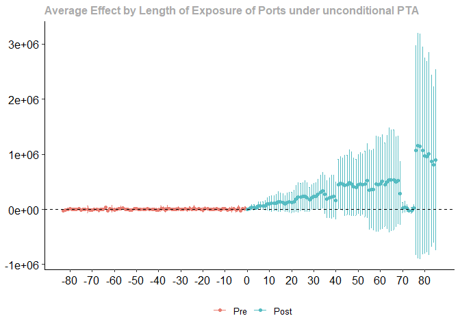
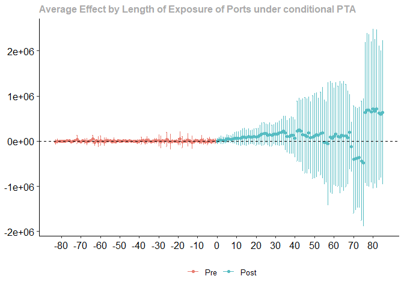
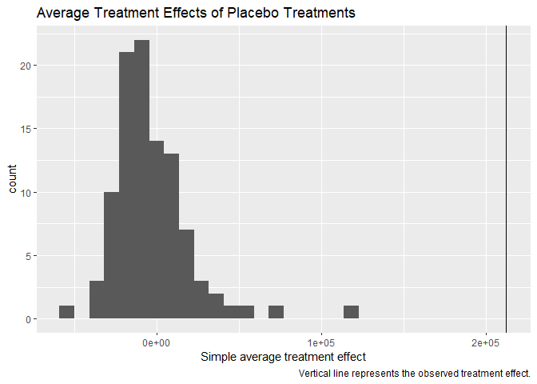
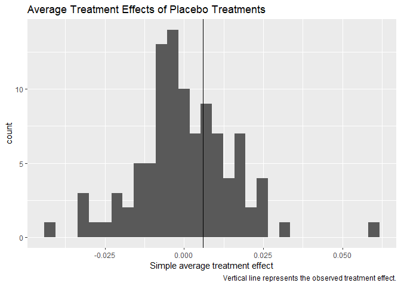

# Baseline equation (fixed effects)

In the first attempt, a simple fixed effects model and aggregated data on container throughput is used to identify the effect of Chinese port ownership. The effect of chinese ownership is included in form of a dummy variable (ChineseControl_it) that is set to one when the ownership (at least partly) transfered to a Chinese company (needs clarification).

$Thrpt_{it}=\alpha_{i}+\gamma_{t}+ChineseOwnership_{it}+e_{it}$ \left (1)

Second, we leverage the bilateral structure of the data, and use the variation between sender country and receiving port over time. The advantage of this approach is, that we can use higher levels of fixed effects, which enable much more precise control over which variation is used to identify the treatment effect. We proceed by estimating multipe equations with different levels of fixed effects with increasing restrictiveness.

$Thrpt_{ijt}=\alpha_{i}+\beta_{j}+\gamma_{t}+ChineseOwnership_{it}+ChineseOwnership_{it}*ChineseOrigin_{ij}+e_{ijt}$ \left (2)

In equation (1), the quarterly ($t$) container throughput ($Thrpt$) is explained by a set of port fixed-effects ($\alpha_{i}$), sender country fixed effects (\beta_{j}), and time fixed effects (\gamma_{t}). This specification controls for all time-invariant port-specific, and all time-invariant sender-specific unobserved covariates. The time fixed effects account for common shocks that affect all European ports equally.  

$Thrpt_{ijt}=\alpha_{ij}+\gamma_{t}+ChineseOwnership_{it}}+ChineseOwnership_{it}*ChineseOrigin_{ij}+e_{ijt}$ \left (3)

Equation (2) increases the restrictiveness of th fixed effects by replacing the port-level fixed effects with port-sender fixed effects. This set of fixed effects controls for all time-invariant sender-port specfic covariates like regular shipping routes and preferences. This setup is often referred to as a difference-in-differences (DiD) set-up, as in the two-period case, equation (2) estimates a standard DiD effect. However, recent studies have shown, that this similarity does not extend to the multi-period case. 

$Thrpt_{ijt}=\alpha_{ij}+\beta_{jt}++ChineseOwnership_{it}+ChineseOwnership_{it}*ChineseOrigin_{ij}+e_{ijt}$ \left (4)

Equation (3) adds another dimension to the fixed effects. In addition to controlling for sender-port time-invariant covariates, it also controls for sender-time fixed effects. These encapsule all sender-time varying covariates like production shocks or supply shortages (as in the case of the blocked Suez Canal in 2021).

$Thrpt_{ijt}=\alpha_{ij}+\beta_{jt}++ChineseOwnership_{it}+ChineseOwnership_{it}*ChineseOrigin_{ij}+ChineseOperation_{it}+e_{ijt}$ \left (5)

Lastly, we add another Dummy variable $ChineseOperation_{it}$, which indicates whether a Chinese company is involved in the operation of the port or whether it just holds equity shares. 


```
##                                       spec1            spec2             spec3
##                                       Eq. 1            Eq. 2             Eq. 3
## Dependent Var.:                   container        container         container
##                                                                               
## ownership_china              654.9* (321.8)   -3.720 (5.457)     1.823 (2.111)
## ownership_china x s_china                     350.9. (202.7)     152.0 (101.7)
## operation                                                                     
## Fixed Effects                --------------   --------------     -------------
## port_code                               yes                                   
## period                                  yes              yes               yes
## port                                                     yes                  
## sender                                                   yes                  
## port-sender                                                                yes
## sender-period                                                                 
## _________________________    ______________   ______________     _____________
## S.E.: Clustered           by: port. & peri. by: port & send. by: port. & peri.
## Observations                         10,268          279,050           279,050
## R2                                  0.90624          0.24779           0.78718
## Within R2                           0.03863          0.03920           0.01437
## 
##                                       spec4             spec5
##                                        Eq.4              Eq.5
## Dependent Var.:                   container         container
##                                                              
## ownership_china            5.985*** (1.758)   -0.8641 (2.054)
## ownership_china x s_china     90.40 (62.46)     86.74 (60.92)
## operation                                    50.20*** (11.73)
## Fixed Effects              ----------------  ----------------
## port_code                                                    
## period                                                       
## port                                                         
## sender                                                       
## port-sender                             yes               yes
## sender-period                           yes               yes
## _________________________  ________________  ________________
## S.E.: Clustered           by: port. & send. by: port. & send.
## Observations                        279,050           279,050
## R2                                  0.81334           0.81596
## Within R2                           0.00587           0.01986
## ---
## Signif. codes: 0 '***' 0.001 '**' 0.01 '*' 0.05 '.' 0.1 ' ' 1
```

While the fixed effects identification strategy presented above is a common one in the literature, many authors criticize the model fo its lack of interpretable results. In particular, it is often unclear how the coefficients in fixed effects models are obtained and which units have served as comparisons to treated units, especially when the treatment timing varies between units. @Chaisemartin.2020 and @Borusyak.2022 find that the treatment effect estimated by two-way fixed effects models (as in equation (2)) is a weighted average of time-specific treatment effects with some weights potentially being negative. In extreme cases, this can cause negative coefficients although all time-specific treatment effects are positive. @GoodmanBacon.2021 point out that the estimator can be seen as a weighted average of all possible comparisons between treated, untreated, and not-yet-treated units, with the weights depending on treatment timing and the number of observations and conclude that a fixed effects set should be avoided, when the treatment effect is likely to vary over time.  

Another common issue is finding reasonable counterfactuals when interpreting the coefficients from fixed effects models. @Mummolo.2018 notes that researchers tend to present unrealistic counterfactuals when using fixed effects regression. Since fixed effect models only use a fraction of the variance to estimate the coefficients, interpreting the model with counterfactuals that are drawn from the original distribution of the data often leads to unrealistically high effects that sometimes falsely imply economically relevant effect sizes. Additionally, the major benefit of fixed effects, the ability to control for unobserved covariates, critically depends on the linear additive assumption [@Imai.2021]. In cases where the variation can be attributed to several dimensions of fixed effects, the estimator is undefined [@Kropko.2020].


# Difference in Differences

To address these shortcomings, we use recent advances in the DiD literature, and employ a staggered DiD estimator by @Callaway.2021. They formulate a unified approach to estimating average treatment effects in a DiD framework with multiple periods and varying treatment timing that avoids all above described interpretation issues. They define group-time average treatment effects, which measure the average treatment effect for a group of units that receive the treatment at the same point in time. In a later step, these group-time average treatment effects can be aggregated either by time period or group to derive an overall average treatment effect. Another advantage of their approach is that it gives the research the liberty to choose which comparison group should be used to calculate the treatment effects. That is, whether the comparison group includes only never-treated or not-yet-treated units. This translates to two parallel trend assumptions. When the comparison group is made up of never treated units:

$E[Y_{t}(0)-Y_{t-1}(0)|G=g]=E[Y_{t}(0)-Y_{t-1}(0)|C=1]$ 
with $g\leq t$ \left (6)

Where $Y_{t}(0)$ denotes the potential untreated outcome in period t, $G$ indicates the period a unit is first treated, and $C$ is an indicator that takes the value of one if a unit is never treated. Hence, the first term of the equation above denotes the difference between untreated outcomes of period t and period t-1 for units while they are treated, and the second term denotes the difference between potential outcomes of periods t and t-1 for units that are never treated. In a setting with staggered treatment, random sampling, and not treatment anticipation, the above parallel trend assumption leads the following group-time average treatment effects: 

$ATT(g,t)=E[Y_{t}(g)-Y_{t}(0)|G=g]=E[Y_{t}-Y_{g-1}|G=g]-E[Y_{t}-Y_{g-1}|C=1]$ \left (7)

Where $Y_{t}(g)$ denotes the treated outcome in period $t$, $Y_{t}$ denotes the observed outcome in period $t$. Hence, the average $ATT(g,t)$ represents the average effect of treatment in period t for units that are first treated in period g. To derive at an overall average treatment effect, we use a simple aggregation scheme as proposed by @Callaway.2021, which weights each ATT by the size of the group. 


```{=html}
<div id="hyittwiyxh" style="padding-left:0px;padding-right:0px;padding-top:10px;padding-bottom:10px;overflow-x:auto;overflow-y:auto;width:auto;height:auto;">
<style>#hyittwiyxh table {
  font-family: system-ui, 'Segoe UI', Roboto, Helvetica, Arial, sans-serif, 'Apple Color Emoji', 'Segoe UI Emoji', 'Segoe UI Symbol', 'Noto Color Emoji';
  -webkit-font-smoothing: antialiased;
  -moz-osx-font-smoothing: grayscale;
}

#hyittwiyxh thead, #hyittwiyxh tbody, #hyittwiyxh tfoot, #hyittwiyxh tr, #hyittwiyxh td, #hyittwiyxh th {
  border-style: none;
}

#hyittwiyxh p {
  margin: 0;
  padding: 0;
}

#hyittwiyxh .gt_table {
  display: table;
  border-collapse: collapse;
  line-height: normal;
  margin-left: auto;
  margin-right: auto;
  color: #333333;
  font-size: 16px;
  font-weight: normal;
  font-style: normal;
  background-color: #FFFFFF;
  width: auto;
  border-top-style: solid;
  border-top-width: 2px;
  border-top-color: #A8A8A8;
  border-right-style: none;
  border-right-width: 2px;
  border-right-color: #D3D3D3;
  border-bottom-style: solid;
  border-bottom-width: 2px;
  border-bottom-color: #A8A8A8;
  border-left-style: none;
  border-left-width: 2px;
  border-left-color: #D3D3D3;
}

#hyittwiyxh .gt_caption {
  padding-top: 4px;
  padding-bottom: 4px;
}

#hyittwiyxh .gt_title {
  color: #333333;
  font-size: 125%;
  font-weight: initial;
  padding-top: 4px;
  padding-bottom: 4px;
  padding-left: 5px;
  padding-right: 5px;
  border-bottom-color: #FFFFFF;
  border-bottom-width: 0;
}

#hyittwiyxh .gt_subtitle {
  color: #333333;
  font-size: 85%;
  font-weight: initial;
  padding-top: 3px;
  padding-bottom: 5px;
  padding-left: 5px;
  padding-right: 5px;
  border-top-color: #FFFFFF;
  border-top-width: 0;
}

#hyittwiyxh .gt_heading {
  background-color: #FFFFFF;
  text-align: center;
  border-bottom-color: #FFFFFF;
  border-left-style: none;
  border-left-width: 1px;
  border-left-color: #D3D3D3;
  border-right-style: none;
  border-right-width: 1px;
  border-right-color: #D3D3D3;
}

#hyittwiyxh .gt_bottom_border {
  border-bottom-style: solid;
  border-bottom-width: 2px;
  border-bottom-color: #D3D3D3;
}

#hyittwiyxh .gt_col_headings {
  border-top-style: solid;
  border-top-width: 2px;
  border-top-color: #D3D3D3;
  border-bottom-style: solid;
  border-bottom-width: 2px;
  border-bottom-color: #D3D3D3;
  border-left-style: none;
  border-left-width: 1px;
  border-left-color: #D3D3D3;
  border-right-style: none;
  border-right-width: 1px;
  border-right-color: #D3D3D3;
}

#hyittwiyxh .gt_col_heading {
  color: #333333;
  background-color: #FFFFFF;
  font-size: 100%;
  font-weight: normal;
  text-transform: inherit;
  border-left-style: none;
  border-left-width: 1px;
  border-left-color: #D3D3D3;
  border-right-style: none;
  border-right-width: 1px;
  border-right-color: #D3D3D3;
  vertical-align: bottom;
  padding-top: 5px;
  padding-bottom: 6px;
  padding-left: 5px;
  padding-right: 5px;
  overflow-x: hidden;
}

#hyittwiyxh .gt_column_spanner_outer {
  color: #333333;
  background-color: #FFFFFF;
  font-size: 100%;
  font-weight: normal;
  text-transform: inherit;
  padding-top: 0;
  padding-bottom: 0;
  padding-left: 4px;
  padding-right: 4px;
}

#hyittwiyxh .gt_column_spanner_outer:first-child {
  padding-left: 0;
}

#hyittwiyxh .gt_column_spanner_outer:last-child {
  padding-right: 0;
}

#hyittwiyxh .gt_column_spanner {
  border-bottom-style: solid;
  border-bottom-width: 2px;
  border-bottom-color: #D3D3D3;
  vertical-align: bottom;
  padding-top: 5px;
  padding-bottom: 5px;
  overflow-x: hidden;
  display: inline-block;
  width: 100%;
}

#hyittwiyxh .gt_spanner_row {
  border-bottom-style: hidden;
}

#hyittwiyxh .gt_group_heading {
  padding-top: 8px;
  padding-bottom: 8px;
  padding-left: 5px;
  padding-right: 5px;
  color: #333333;
  background-color: #FFFFFF;
  font-size: 100%;
  font-weight: initial;
  text-transform: inherit;
  border-top-style: solid;
  border-top-width: 2px;
  border-top-color: #D3D3D3;
  border-bottom-style: solid;
  border-bottom-width: 2px;
  border-bottom-color: #D3D3D3;
  border-left-style: none;
  border-left-width: 1px;
  border-left-color: #D3D3D3;
  border-right-style: none;
  border-right-width: 1px;
  border-right-color: #D3D3D3;
  vertical-align: middle;
  text-align: left;
}

#hyittwiyxh .gt_empty_group_heading {
  padding: 0.5px;
  color: #333333;
  background-color: #FFFFFF;
  font-size: 100%;
  font-weight: initial;
  border-top-style: solid;
  border-top-width: 2px;
  border-top-color: #D3D3D3;
  border-bottom-style: solid;
  border-bottom-width: 2px;
  border-bottom-color: #D3D3D3;
  vertical-align: middle;
}

#hyittwiyxh .gt_from_md > :first-child {
  margin-top: 0;
}

#hyittwiyxh .gt_from_md > :last-child {
  margin-bottom: 0;
}

#hyittwiyxh .gt_row {
  padding-top: 8px;
  padding-bottom: 8px;
  padding-left: 5px;
  padding-right: 5px;
  margin: 10px;
  border-top-style: solid;
  border-top-width: 1px;
  border-top-color: #D3D3D3;
  border-left-style: none;
  border-left-width: 1px;
  border-left-color: #D3D3D3;
  border-right-style: none;
  border-right-width: 1px;
  border-right-color: #D3D3D3;
  vertical-align: middle;
  overflow-x: hidden;
}

#hyittwiyxh .gt_stub {
  color: #333333;
  background-color: #FFFFFF;
  font-size: 100%;
  font-weight: initial;
  text-transform: inherit;
  border-right-style: solid;
  border-right-width: 2px;
  border-right-color: #D3D3D3;
  padding-left: 5px;
  padding-right: 5px;
}

#hyittwiyxh .gt_stub_row_group {
  color: #333333;
  background-color: #FFFFFF;
  font-size: 100%;
  font-weight: initial;
  text-transform: inherit;
  border-right-style: solid;
  border-right-width: 2px;
  border-right-color: #D3D3D3;
  padding-left: 5px;
  padding-right: 5px;
  vertical-align: top;
}

#hyittwiyxh .gt_row_group_first td {
  border-top-width: 2px;
}

#hyittwiyxh .gt_row_group_first th {
  border-top-width: 2px;
}

#hyittwiyxh .gt_summary_row {
  color: #333333;
  background-color: #FFFFFF;
  text-transform: inherit;
  padding-top: 8px;
  padding-bottom: 8px;
  padding-left: 5px;
  padding-right: 5px;
}

#hyittwiyxh .gt_first_summary_row {
  border-top-style: solid;
  border-top-color: #D3D3D3;
}

#hyittwiyxh .gt_first_summary_row.thick {
  border-top-width: 2px;
}

#hyittwiyxh .gt_last_summary_row {
  padding-top: 8px;
  padding-bottom: 8px;
  padding-left: 5px;
  padding-right: 5px;
  border-bottom-style: solid;
  border-bottom-width: 2px;
  border-bottom-color: #D3D3D3;
}

#hyittwiyxh .gt_grand_summary_row {
  color: #333333;
  background-color: #FFFFFF;
  text-transform: inherit;
  padding-top: 8px;
  padding-bottom: 8px;
  padding-left: 5px;
  padding-right: 5px;
}

#hyittwiyxh .gt_first_grand_summary_row {
  padding-top: 8px;
  padding-bottom: 8px;
  padding-left: 5px;
  padding-right: 5px;
  border-top-style: double;
  border-top-width: 6px;
  border-top-color: #D3D3D3;
}

#hyittwiyxh .gt_last_grand_summary_row_top {
  padding-top: 8px;
  padding-bottom: 8px;
  padding-left: 5px;
  padding-right: 5px;
  border-bottom-style: double;
  border-bottom-width: 6px;
  border-bottom-color: #D3D3D3;
}

#hyittwiyxh .gt_striped {
  background-color: rgba(128, 128, 128, 0.05);
}

#hyittwiyxh .gt_table_body {
  border-top-style: solid;
  border-top-width: 2px;
  border-top-color: #D3D3D3;
  border-bottom-style: solid;
  border-bottom-width: 2px;
  border-bottom-color: #D3D3D3;
}

#hyittwiyxh .gt_footnotes {
  color: #333333;
  background-color: #FFFFFF;
  border-bottom-style: none;
  border-bottom-width: 2px;
  border-bottom-color: #D3D3D3;
  border-left-style: none;
  border-left-width: 2px;
  border-left-color: #D3D3D3;
  border-right-style: none;
  border-right-width: 2px;
  border-right-color: #D3D3D3;
}

#hyittwiyxh .gt_footnote {
  margin: 0px;
  font-size: 90%;
  padding-top: 4px;
  padding-bottom: 4px;
  padding-left: 5px;
  padding-right: 5px;
}

#hyittwiyxh .gt_sourcenotes {
  color: #333333;
  background-color: #FFFFFF;
  border-bottom-style: none;
  border-bottom-width: 2px;
  border-bottom-color: #D3D3D3;
  border-left-style: none;
  border-left-width: 2px;
  border-left-color: #D3D3D3;
  border-right-style: none;
  border-right-width: 2px;
  border-right-color: #D3D3D3;
}

#hyittwiyxh .gt_sourcenote {
  font-size: 90%;
  padding-top: 4px;
  padding-bottom: 4px;
  padding-left: 5px;
  padding-right: 5px;
}

#hyittwiyxh .gt_left {
  text-align: left;
}

#hyittwiyxh .gt_center {
  text-align: center;
}

#hyittwiyxh .gt_right {
  text-align: right;
  font-variant-numeric: tabular-nums;
}

#hyittwiyxh .gt_font_normal {
  font-weight: normal;
}

#hyittwiyxh .gt_font_bold {
  font-weight: bold;
}

#hyittwiyxh .gt_font_italic {
  font-style: italic;
}

#hyittwiyxh .gt_super {
  font-size: 65%;
}

#hyittwiyxh .gt_footnote_marks {
  font-size: 75%;
  vertical-align: 0.4em;
  position: initial;
}

#hyittwiyxh .gt_asterisk {
  font-size: 100%;
  vertical-align: 0;
}

#hyittwiyxh .gt_indent_1 {
  text-indent: 5px;
}

#hyittwiyxh .gt_indent_2 {
  text-indent: 10px;
}

#hyittwiyxh .gt_indent_3 {
  text-indent: 15px;
}

#hyittwiyxh .gt_indent_4 {
  text-indent: 20px;
}

#hyittwiyxh .gt_indent_5 {
  text-indent: 25px;
}
</style>
<table class="gt_table" data-quarto-disable-processing="false" data-quarto-bootstrap="false">
  <thead>
    <tr class="gt_heading">
      <td colspan="7" class="gt_heading gt_title gt_font_normal" style>Aggregation of group time average treatment effects</td>
    </tr>
    <tr class="gt_heading">
      <td colspan="7" class="gt_heading gt_subtitle gt_font_normal gt_bottom_border" style>Control group: Never treated</td>
    </tr>
    <tr class="gt_col_headings gt_spanner_row">
      <th class="gt_col_heading gt_columns_bottom_border gt_left" rowspan="2" colspan="1" scope="col" id=""></th>
      <th class="gt_center gt_columns_top_border gt_column_spanner_outer" rowspan="1" colspan="3" scope="colgroup" id="Chinese ownership">
        <span class="gt_column_spanner">Chinese ownership</span>
      </th>
      <th class="gt_center gt_columns_top_border gt_column_spanner_outer" rowspan="1" colspan="3" scope="colgroup" id="Chinese operation">
        <span class="gt_column_spanner">Chinese operation</span>
      </th>
    </tr>
    <tr class="gt_col_headings">
      <th class="gt_col_heading gt_columns_bottom_border gt_right" rowspan="1" colspan="1" scope="col" id="ATT">ATT</th>
      <th class="gt_col_heading gt_columns_bottom_border gt_right" rowspan="1" colspan="1" scope="col" id="[95%">[95%</th>
      <th class="gt_col_heading gt_columns_bottom_border gt_right" rowspan="1" colspan="1" scope="col" id="conf.int.]">conf.int.]</th>
      <th class="gt_col_heading gt_columns_bottom_border gt_right" rowspan="1" colspan="1" scope="col" id="ATT">ATT</th>
      <th class="gt_col_heading gt_columns_bottom_border gt_right" rowspan="1" colspan="1" scope="col" id="[95%">[95%</th>
      <th class="gt_col_heading gt_columns_bottom_border gt_right" rowspan="1" colspan="1" scope="col" id="conf.int.]">conf.int.]</th>
    </tr>
  </thead>
  <tbody class="gt_table_body">
    <tr class="gt_group_heading_row">
      <th colspan="7" class="gt_empty_group_heading" scope="colgroup" id=""></th>
    </tr>
    <tr class="gt_row_group_first"><th id="stub_1_1" scope="row" class="gt_row gt_left gt_stub">simple average</th>
<td headers="NA stub_1_1 ATT.x" class="gt_row gt_right">1,183.05</td>
<td headers="NA stub_1_1 lower.x" class="gt_row gt_right">−861.11</td>
<td headers="NA stub_1_1 upper.x" class="gt_row gt_right">3,227.20</td>
<td headers="NA stub_1_1 ATT.y" class="gt_row gt_right">1,207.22</td>
<td headers="NA stub_1_1 lower.y" class="gt_row gt_right">−601.23</td>
<td headers="NA stub_1_1 upper.y" class="gt_row gt_right">3,015.67</td></tr>
    <tr class="gt_group_heading_row">
      <th colspan="7" class="gt_group_heading" scope="colgroup" id="by group:">by group:</th>
    </tr>
    <tr class="gt_row_group_first"><th id="stub_1_2" scope="row" class="gt_row gt_left gt_stub">Ambarli (76)</th>
<td headers="by group: stub_1_2 ATT.x" class="gt_row gt_right">−461.60<span class="gt_footnote_marks gt_asterisk" style="white-space:nowrap;font-style:italic;font-weight:normal;"><sup>*</sup></span></td>
<td headers="by group: stub_1_2 lower.x" class="gt_row gt_right">−570.64</td>
<td headers="by group: stub_1_2 upper.x" class="gt_row gt_right">−352.56</td>
<td headers="by group: stub_1_2 ATT.y" class="gt_row gt_right"><br /></td>
<td headers="by group: stub_1_2 lower.y" class="gt_row gt_right"><br /></td>
<td headers="by group: stub_1_2 upper.y" class="gt_row gt_right"><br /></td></tr>
    <tr><th id="stub_1_3" scope="row" class="gt_row gt_left gt_stub">Amsterdam, Thessaloniki (85)</th>
<td headers="by group: stub_1_3 ATT.x" class="gt_row gt_right">−8.06</td>
<td headers="by group: stub_1_3 lower.x" class="gt_row gt_right">−134.77</td>
<td headers="by group: stub_1_3 upper.x" class="gt_row gt_right">118.65</td>
<td headers="by group: stub_1_3 ATT.y" class="gt_row gt_right"><br /></td>
<td headers="by group: stub_1_3 lower.y" class="gt_row gt_right"><br /></td>
<td headers="by group: stub_1_3 upper.y" class="gt_row gt_right"><br /></td></tr>
    <tr><th id="stub_1_4" scope="row" class="gt_row gt_left gt_stub">Barcelona (63)</th>
<td headers="by group: stub_1_4 ATT.x" class="gt_row gt_right">796.40<span class="gt_footnote_marks gt_asterisk" style="white-space:nowrap;font-style:italic;font-weight:normal;"><sup>*</sup></span></td>
<td headers="by group: stub_1_4 lower.x" class="gt_row gt_right">702.98</td>
<td headers="by group: stub_1_4 upper.x" class="gt_row gt_right">889.82</td>
<td headers="by group: stub_1_4 ATT.y" class="gt_row gt_right"><br /></td>
<td headers="by group: stub_1_4 lower.y" class="gt_row gt_right"><br /></td>
<td headers="by group: stub_1_4 upper.y" class="gt_row gt_right"><br /></td></tr>
    <tr><th id="stub_1_5" scope="row" class="gt_row gt_left gt_stub">Bilbao, Valencia (84)</th>
<td headers="by group: stub_1_5 ATT.x" class="gt_row gt_right">54.06</td>
<td headers="by group: stub_1_5 lower.x" class="gt_row gt_right">−182.78</td>
<td headers="by group: stub_1_5 upper.x" class="gt_row gt_right">290.90</td>
<td headers="by group: stub_1_5 ATT.y" class="gt_row gt_right"><br /></td>
<td headers="by group: stub_1_5 lower.y" class="gt_row gt_right"><br /></td>
<td headers="by group: stub_1_5 upper.y" class="gt_row gt_right"><br /></td></tr>
    <tr><th id="stub_1_6" scope="row" class="gt_row gt_left gt_stub">Dunkerque, Le Havre, Marsaxlokk, Marseille (66)</th>
<td headers="by group: stub_1_6 ATT.x" class="gt_row gt_right">63.56</td>
<td headers="by group: stub_1_6 lower.x" class="gt_row gt_right">−156.53</td>
<td headers="by group: stub_1_6 upper.x" class="gt_row gt_right">283.65</td>
<td headers="by group: stub_1_6 ATT.y" class="gt_row gt_right"><br /></td>
<td headers="by group: stub_1_6 lower.y" class="gt_row gt_right"><br /></td>
<td headers="by group: stub_1_6 upper.y" class="gt_row gt_right"><br /></td></tr>
    <tr><th id="stub_1_7" scope="row" class="gt_row gt_left gt_stub">Gdynia (38)</th>
<td headers="by group: stub_1_7 ATT.x" class="gt_row gt_right">41.36</td>
<td headers="by group: stub_1_7 lower.x" class="gt_row gt_right">−45.12</td>
<td headers="by group: stub_1_7 upper.x" class="gt_row gt_right">127.83</td>
<td headers="by group: stub_1_7 ATT.y" class="gt_row gt_right"><br /></td>
<td headers="by group: stub_1_7 lower.y" class="gt_row gt_right"><br /></td>
<td headers="by group: stub_1_7 upper.y" class="gt_row gt_right"><br /></td></tr>
    <tr><th id="stub_1_8" scope="row" class="gt_row gt_left gt_stub">Genova (81)</th>
<td headers="by group: stub_1_8 ATT.x" class="gt_row gt_right">222.03<span class="gt_footnote_marks gt_asterisk" style="white-space:nowrap;font-style:italic;font-weight:normal;"><sup>*</sup></span></td>
<td headers="by group: stub_1_8 lower.x" class="gt_row gt_right">118.73</td>
<td headers="by group: stub_1_8 upper.x" class="gt_row gt_right">325.33</td>
<td headers="by group: stub_1_8 ATT.y" class="gt_row gt_right">197.20<span class="gt_footnote_marks gt_asterisk" style="white-space:nowrap;font-style:italic;font-weight:normal;"><sup>*</sup></span></td>
<td headers="by group: stub_1_8 lower.y" class="gt_row gt_right">84.70</td>
<td headers="by group: stub_1_8 upper.y" class="gt_row gt_right">309.70</td></tr>
    <tr><th id="stub_1_9" scope="row" class="gt_row gt_left gt_stub">Moerdijk, Rotterdam (21)</th>
<td headers="by group: stub_1_9 ATT.x" class="gt_row gt_right">3,212.35<span class="gt_footnote_marks gt_asterisk" style="white-space:nowrap;font-style:italic;font-weight:normal;"><sup>*</sup></span></td>
<td headers="by group: stub_1_9 lower.x" class="gt_row gt_right">2,935.92</td>
<td headers="by group: stub_1_9 upper.x" class="gt_row gt_right">3,488.77</td>
<td headers="by group: stub_1_9 ATT.y" class="gt_row gt_right">−151.78<span class="gt_footnote_marks gt_asterisk" style="white-space:nowrap;font-style:italic;font-weight:normal;"><sup>*</sup></span></td>
<td headers="by group: stub_1_9 lower.y" class="gt_row gt_right">−259.44</td>
<td headers="by group: stub_1_9 upper.y" class="gt_row gt_right">−44.12</td></tr>
    <tr><th id="stub_1_10" scope="row" class="gt_row gt_left gt_stub">Piraeus (52)</th>
<td headers="by group: stub_1_10 ATT.x" class="gt_row gt_right">3,224.92<span class="gt_footnote_marks gt_asterisk" style="white-space:nowrap;font-style:italic;font-weight:normal;"><sup>*</sup></span></td>
<td headers="by group: stub_1_10 lower.x" class="gt_row gt_right">3,120.77</td>
<td headers="by group: stub_1_10 upper.x" class="gt_row gt_right">3,329.08</td>
<td headers="by group: stub_1_10 ATT.y" class="gt_row gt_right">3,206.82<span class="gt_footnote_marks gt_asterisk" style="white-space:nowrap;font-style:italic;font-weight:normal;"><sup>*</sup></span></td>
<td headers="by group: stub_1_10 lower.y" class="gt_row gt_right">3,112.06</td>
<td headers="by group: stub_1_10 upper.y" class="gt_row gt_right">3,301.58</td></tr>
    <tr><th id="stub_1_11" scope="row" class="gt_row gt_left gt_stub">Rotterdam (80)</th>
<td headers="by group: stub_1_11 ATT.x" class="gt_row gt_right"><br /></td>
<td headers="by group: stub_1_11 lower.x" class="gt_row gt_right"><br /></td>
<td headers="by group: stub_1_11 upper.x" class="gt_row gt_right"><br /></td>
<td headers="by group: stub_1_11 ATT.y" class="gt_row gt_right">2,435.24<span class="gt_footnote_marks gt_asterisk" style="white-space:nowrap;font-style:italic;font-weight:normal;"><sup>*</sup></span></td>
<td headers="by group: stub_1_11 lower.y" class="gt_row gt_right">2,341.79</td>
<td headers="by group: stub_1_11 upper.y" class="gt_row gt_right">2,528.70</td></tr>
  </tbody>
  
  <tfoot class="gt_footnotes">
    <tr>
      <td class="gt_footnote" colspan="7"> First treatment period in brackets.</td>
    </tr>
    <tr>
      <td class="gt_footnote" colspan="7"><span class="gt_footnote_marks gt_asterisk" style="white-space:nowrap;font-style:italic;font-weight:normal;"><sup>*</sup></span> Confidence interval does not include zero.</td>
    </tr>
  </tfoot>
</table>
</div>
```


One potential issue, that above DiD model may have is endogeneity. In particular, ports may be selected into treatment based on their throughput in the past. If that is the case, untreated units do not pose a credible comparison group to estimate treatment effects. To alleviate those concerns, we reestimate the treatment effects adding the not yet treated observations as the comparison group. Following @Callaway.2021, the underlying parallel trend assumption is then: 

$E[Y_{t}-Y_{t-1}|G=g]=E[Y_{t}-Y_{t-1}|D_{t}=0, G\neq g]$ with $g\leq t$ \left (8)

Where $D_{t}$ is an binary variable indicating whether a unit is treated in period t. The new parallel trend assumption then leads to the following group-time average treatment effects:

$ATT(g,t)=E[Y_{t}(g)-Y_{t}(0)|G=g]=E[Y_{t}-Y_{g-1}|G=g]-E[Y_{t}-Y_{g-1}|D_{t}=0, G\neq g]$ \left (9)

Hence $ATT(g,t)$ represents the average treatment effect of group $G$ in period $t$ in comparison to not yet treated units (and untreated units). 


```{=html}
<div id="lxcxiycdtr" style="padding-left:0px;padding-right:0px;padding-top:10px;padding-bottom:10px;overflow-x:auto;overflow-y:auto;width:auto;height:auto;">
<style>#lxcxiycdtr table {
  font-family: system-ui, 'Segoe UI', Roboto, Helvetica, Arial, sans-serif, 'Apple Color Emoji', 'Segoe UI Emoji', 'Segoe UI Symbol', 'Noto Color Emoji';
  -webkit-font-smoothing: antialiased;
  -moz-osx-font-smoothing: grayscale;
}

#lxcxiycdtr thead, #lxcxiycdtr tbody, #lxcxiycdtr tfoot, #lxcxiycdtr tr, #lxcxiycdtr td, #lxcxiycdtr th {
  border-style: none;
}

#lxcxiycdtr p {
  margin: 0;
  padding: 0;
}

#lxcxiycdtr .gt_table {
  display: table;
  border-collapse: collapse;
  line-height: normal;
  margin-left: auto;
  margin-right: auto;
  color: #333333;
  font-size: 16px;
  font-weight: normal;
  font-style: normal;
  background-color: #FFFFFF;
  width: auto;
  border-top-style: solid;
  border-top-width: 2px;
  border-top-color: #A8A8A8;
  border-right-style: none;
  border-right-width: 2px;
  border-right-color: #D3D3D3;
  border-bottom-style: solid;
  border-bottom-width: 2px;
  border-bottom-color: #A8A8A8;
  border-left-style: none;
  border-left-width: 2px;
  border-left-color: #D3D3D3;
}

#lxcxiycdtr .gt_caption {
  padding-top: 4px;
  padding-bottom: 4px;
}

#lxcxiycdtr .gt_title {
  color: #333333;
  font-size: 125%;
  font-weight: initial;
  padding-top: 4px;
  padding-bottom: 4px;
  padding-left: 5px;
  padding-right: 5px;
  border-bottom-color: #FFFFFF;
  border-bottom-width: 0;
}

#lxcxiycdtr .gt_subtitle {
  color: #333333;
  font-size: 85%;
  font-weight: initial;
  padding-top: 3px;
  padding-bottom: 5px;
  padding-left: 5px;
  padding-right: 5px;
  border-top-color: #FFFFFF;
  border-top-width: 0;
}

#lxcxiycdtr .gt_heading {
  background-color: #FFFFFF;
  text-align: center;
  border-bottom-color: #FFFFFF;
  border-left-style: none;
  border-left-width: 1px;
  border-left-color: #D3D3D3;
  border-right-style: none;
  border-right-width: 1px;
  border-right-color: #D3D3D3;
}

#lxcxiycdtr .gt_bottom_border {
  border-bottom-style: solid;
  border-bottom-width: 2px;
  border-bottom-color: #D3D3D3;
}

#lxcxiycdtr .gt_col_headings {
  border-top-style: solid;
  border-top-width: 2px;
  border-top-color: #D3D3D3;
  border-bottom-style: solid;
  border-bottom-width: 2px;
  border-bottom-color: #D3D3D3;
  border-left-style: none;
  border-left-width: 1px;
  border-left-color: #D3D3D3;
  border-right-style: none;
  border-right-width: 1px;
  border-right-color: #D3D3D3;
}

#lxcxiycdtr .gt_col_heading {
  color: #333333;
  background-color: #FFFFFF;
  font-size: 100%;
  font-weight: normal;
  text-transform: inherit;
  border-left-style: none;
  border-left-width: 1px;
  border-left-color: #D3D3D3;
  border-right-style: none;
  border-right-width: 1px;
  border-right-color: #D3D3D3;
  vertical-align: bottom;
  padding-top: 5px;
  padding-bottom: 6px;
  padding-left: 5px;
  padding-right: 5px;
  overflow-x: hidden;
}

#lxcxiycdtr .gt_column_spanner_outer {
  color: #333333;
  background-color: #FFFFFF;
  font-size: 100%;
  font-weight: normal;
  text-transform: inherit;
  padding-top: 0;
  padding-bottom: 0;
  padding-left: 4px;
  padding-right: 4px;
}

#lxcxiycdtr .gt_column_spanner_outer:first-child {
  padding-left: 0;
}

#lxcxiycdtr .gt_column_spanner_outer:last-child {
  padding-right: 0;
}

#lxcxiycdtr .gt_column_spanner {
  border-bottom-style: solid;
  border-bottom-width: 2px;
  border-bottom-color: #D3D3D3;
  vertical-align: bottom;
  padding-top: 5px;
  padding-bottom: 5px;
  overflow-x: hidden;
  display: inline-block;
  width: 100%;
}

#lxcxiycdtr .gt_spanner_row {
  border-bottom-style: hidden;
}

#lxcxiycdtr .gt_group_heading {
  padding-top: 8px;
  padding-bottom: 8px;
  padding-left: 5px;
  padding-right: 5px;
  color: #333333;
  background-color: #FFFFFF;
  font-size: 100%;
  font-weight: initial;
  text-transform: inherit;
  border-top-style: solid;
  border-top-width: 2px;
  border-top-color: #D3D3D3;
  border-bottom-style: solid;
  border-bottom-width: 2px;
  border-bottom-color: #D3D3D3;
  border-left-style: none;
  border-left-width: 1px;
  border-left-color: #D3D3D3;
  border-right-style: none;
  border-right-width: 1px;
  border-right-color: #D3D3D3;
  vertical-align: middle;
  text-align: left;
}

#lxcxiycdtr .gt_empty_group_heading {
  padding: 0.5px;
  color: #333333;
  background-color: #FFFFFF;
  font-size: 100%;
  font-weight: initial;
  border-top-style: solid;
  border-top-width: 2px;
  border-top-color: #D3D3D3;
  border-bottom-style: solid;
  border-bottom-width: 2px;
  border-bottom-color: #D3D3D3;
  vertical-align: middle;
}

#lxcxiycdtr .gt_from_md > :first-child {
  margin-top: 0;
}

#lxcxiycdtr .gt_from_md > :last-child {
  margin-bottom: 0;
}

#lxcxiycdtr .gt_row {
  padding-top: 8px;
  padding-bottom: 8px;
  padding-left: 5px;
  padding-right: 5px;
  margin: 10px;
  border-top-style: solid;
  border-top-width: 1px;
  border-top-color: #D3D3D3;
  border-left-style: none;
  border-left-width: 1px;
  border-left-color: #D3D3D3;
  border-right-style: none;
  border-right-width: 1px;
  border-right-color: #D3D3D3;
  vertical-align: middle;
  overflow-x: hidden;
}

#lxcxiycdtr .gt_stub {
  color: #333333;
  background-color: #FFFFFF;
  font-size: 100%;
  font-weight: initial;
  text-transform: inherit;
  border-right-style: solid;
  border-right-width: 2px;
  border-right-color: #D3D3D3;
  padding-left: 5px;
  padding-right: 5px;
}

#lxcxiycdtr .gt_stub_row_group {
  color: #333333;
  background-color: #FFFFFF;
  font-size: 100%;
  font-weight: initial;
  text-transform: inherit;
  border-right-style: solid;
  border-right-width: 2px;
  border-right-color: #D3D3D3;
  padding-left: 5px;
  padding-right: 5px;
  vertical-align: top;
}

#lxcxiycdtr .gt_row_group_first td {
  border-top-width: 2px;
}

#lxcxiycdtr .gt_row_group_first th {
  border-top-width: 2px;
}

#lxcxiycdtr .gt_summary_row {
  color: #333333;
  background-color: #FFFFFF;
  text-transform: inherit;
  padding-top: 8px;
  padding-bottom: 8px;
  padding-left: 5px;
  padding-right: 5px;
}

#lxcxiycdtr .gt_first_summary_row {
  border-top-style: solid;
  border-top-color: #D3D3D3;
}

#lxcxiycdtr .gt_first_summary_row.thick {
  border-top-width: 2px;
}

#lxcxiycdtr .gt_last_summary_row {
  padding-top: 8px;
  padding-bottom: 8px;
  padding-left: 5px;
  padding-right: 5px;
  border-bottom-style: solid;
  border-bottom-width: 2px;
  border-bottom-color: #D3D3D3;
}

#lxcxiycdtr .gt_grand_summary_row {
  color: #333333;
  background-color: #FFFFFF;
  text-transform: inherit;
  padding-top: 8px;
  padding-bottom: 8px;
  padding-left: 5px;
  padding-right: 5px;
}

#lxcxiycdtr .gt_first_grand_summary_row {
  padding-top: 8px;
  padding-bottom: 8px;
  padding-left: 5px;
  padding-right: 5px;
  border-top-style: double;
  border-top-width: 6px;
  border-top-color: #D3D3D3;
}

#lxcxiycdtr .gt_last_grand_summary_row_top {
  padding-top: 8px;
  padding-bottom: 8px;
  padding-left: 5px;
  padding-right: 5px;
  border-bottom-style: double;
  border-bottom-width: 6px;
  border-bottom-color: #D3D3D3;
}

#lxcxiycdtr .gt_striped {
  background-color: rgba(128, 128, 128, 0.05);
}

#lxcxiycdtr .gt_table_body {
  border-top-style: solid;
  border-top-width: 2px;
  border-top-color: #D3D3D3;
  border-bottom-style: solid;
  border-bottom-width: 2px;
  border-bottom-color: #D3D3D3;
}

#lxcxiycdtr .gt_footnotes {
  color: #333333;
  background-color: #FFFFFF;
  border-bottom-style: none;
  border-bottom-width: 2px;
  border-bottom-color: #D3D3D3;
  border-left-style: none;
  border-left-width: 2px;
  border-left-color: #D3D3D3;
  border-right-style: none;
  border-right-width: 2px;
  border-right-color: #D3D3D3;
}

#lxcxiycdtr .gt_footnote {
  margin: 0px;
  font-size: 90%;
  padding-top: 4px;
  padding-bottom: 4px;
  padding-left: 5px;
  padding-right: 5px;
}

#lxcxiycdtr .gt_sourcenotes {
  color: #333333;
  background-color: #FFFFFF;
  border-bottom-style: none;
  border-bottom-width: 2px;
  border-bottom-color: #D3D3D3;
  border-left-style: none;
  border-left-width: 2px;
  border-left-color: #D3D3D3;
  border-right-style: none;
  border-right-width: 2px;
  border-right-color: #D3D3D3;
}

#lxcxiycdtr .gt_sourcenote {
  font-size: 90%;
  padding-top: 4px;
  padding-bottom: 4px;
  padding-left: 5px;
  padding-right: 5px;
}

#lxcxiycdtr .gt_left {
  text-align: left;
}

#lxcxiycdtr .gt_center {
  text-align: center;
}

#lxcxiycdtr .gt_right {
  text-align: right;
  font-variant-numeric: tabular-nums;
}

#lxcxiycdtr .gt_font_normal {
  font-weight: normal;
}

#lxcxiycdtr .gt_font_bold {
  font-weight: bold;
}

#lxcxiycdtr .gt_font_italic {
  font-style: italic;
}

#lxcxiycdtr .gt_super {
  font-size: 65%;
}

#lxcxiycdtr .gt_footnote_marks {
  font-size: 75%;
  vertical-align: 0.4em;
  position: initial;
}

#lxcxiycdtr .gt_asterisk {
  font-size: 100%;
  vertical-align: 0;
}

#lxcxiycdtr .gt_indent_1 {
  text-indent: 5px;
}

#lxcxiycdtr .gt_indent_2 {
  text-indent: 10px;
}

#lxcxiycdtr .gt_indent_3 {
  text-indent: 15px;
}

#lxcxiycdtr .gt_indent_4 {
  text-indent: 20px;
}

#lxcxiycdtr .gt_indent_5 {
  text-indent: 25px;
}
</style>
<table class="gt_table" data-quarto-disable-processing="false" data-quarto-bootstrap="false">
  <thead>
    <tr class="gt_heading">
      <td colspan="7" class="gt_heading gt_title gt_font_normal" style>Aggregation of group time average treatment effects</td>
    </tr>
    <tr class="gt_heading">
      <td colspan="7" class="gt_heading gt_subtitle gt_font_normal gt_bottom_border" style>Control group: Never treated and not yet treated</td>
    </tr>
    <tr class="gt_col_headings gt_spanner_row">
      <th class="gt_col_heading gt_columns_bottom_border gt_left" rowspan="2" colspan="1" scope="col" id=""></th>
      <th class="gt_center gt_columns_top_border gt_column_spanner_outer" rowspan="1" colspan="3" scope="colgroup" id="Chinese ownership">
        <span class="gt_column_spanner">Chinese ownership</span>
      </th>
      <th class="gt_center gt_columns_top_border gt_column_spanner_outer" rowspan="1" colspan="3" scope="colgroup" id="Chinese operation">
        <span class="gt_column_spanner">Chinese operation</span>
      </th>
    </tr>
    <tr class="gt_col_headings">
      <th class="gt_col_heading gt_columns_bottom_border gt_right" rowspan="1" colspan="1" scope="col" id="ATT">ATT</th>
      <th class="gt_col_heading gt_columns_bottom_border gt_right" rowspan="1" colspan="1" scope="col" id="[95%">[95%</th>
      <th class="gt_col_heading gt_columns_bottom_border gt_right" rowspan="1" colspan="1" scope="col" id="conf.int.]">conf.int.]</th>
      <th class="gt_col_heading gt_columns_bottom_border gt_right" rowspan="1" colspan="1" scope="col" id="ATT">ATT</th>
      <th class="gt_col_heading gt_columns_bottom_border gt_right" rowspan="1" colspan="1" scope="col" id="[95%">[95%</th>
      <th class="gt_col_heading gt_columns_bottom_border gt_right" rowspan="1" colspan="1" scope="col" id="conf.int.]">conf.int.]</th>
    </tr>
  </thead>
  <tbody class="gt_table_body">
    <tr class="gt_group_heading_row">
      <th colspan="7" class="gt_empty_group_heading" scope="colgroup" id=""></th>
    </tr>
    <tr class="gt_row_group_first"><th id="stub_1_1" scope="row" class="gt_row gt_left gt_stub">simple average</th>
<td headers="NA stub_1_1 ATT.x" class="gt_row gt_right">1,183.05</td>
<td headers="NA stub_1_1 lower.x" class="gt_row gt_right">−861.11</td>
<td headers="NA stub_1_1 upper.x" class="gt_row gt_right">3,227.20</td>
<td headers="NA stub_1_1 ATT.y" class="gt_row gt_right">1,207.22</td>
<td headers="NA stub_1_1 lower.y" class="gt_row gt_right">−601.23</td>
<td headers="NA stub_1_1 upper.y" class="gt_row gt_right">3,015.67</td></tr>
    <tr class="gt_group_heading_row">
      <th colspan="7" class="gt_group_heading" scope="colgroup" id="by group:">by group:</th>
    </tr>
    <tr class="gt_row_group_first"><th id="stub_1_2" scope="row" class="gt_row gt_left gt_stub">Ambarli (76)</th>
<td headers="by group: stub_1_2 ATT.x" class="gt_row gt_right">−461.60<span class="gt_footnote_marks gt_asterisk" style="white-space:nowrap;font-style:italic;font-weight:normal;"><sup>*</sup></span></td>
<td headers="by group: stub_1_2 lower.x" class="gt_row gt_right">−570.64</td>
<td headers="by group: stub_1_2 upper.x" class="gt_row gt_right">−352.56</td>
<td headers="by group: stub_1_2 ATT.y" class="gt_row gt_right"><br /></td>
<td headers="by group: stub_1_2 lower.y" class="gt_row gt_right"><br /></td>
<td headers="by group: stub_1_2 upper.y" class="gt_row gt_right"><br /></td></tr>
    <tr><th id="stub_1_3" scope="row" class="gt_row gt_left gt_stub">Amsterdam, Thessaloniki (85)</th>
<td headers="by group: stub_1_3 ATT.x" class="gt_row gt_right">−8.06</td>
<td headers="by group: stub_1_3 lower.x" class="gt_row gt_right">−134.77</td>
<td headers="by group: stub_1_3 upper.x" class="gt_row gt_right">118.65</td>
<td headers="by group: stub_1_3 ATT.y" class="gt_row gt_right"><br /></td>
<td headers="by group: stub_1_3 lower.y" class="gt_row gt_right"><br /></td>
<td headers="by group: stub_1_3 upper.y" class="gt_row gt_right"><br /></td></tr>
    <tr><th id="stub_1_4" scope="row" class="gt_row gt_left gt_stub">Barcelona (63)</th>
<td headers="by group: stub_1_4 ATT.x" class="gt_row gt_right">796.40<span class="gt_footnote_marks gt_asterisk" style="white-space:nowrap;font-style:italic;font-weight:normal;"><sup>*</sup></span></td>
<td headers="by group: stub_1_4 lower.x" class="gt_row gt_right">702.98</td>
<td headers="by group: stub_1_4 upper.x" class="gt_row gt_right">889.82</td>
<td headers="by group: stub_1_4 ATT.y" class="gt_row gt_right"><br /></td>
<td headers="by group: stub_1_4 lower.y" class="gt_row gt_right"><br /></td>
<td headers="by group: stub_1_4 upper.y" class="gt_row gt_right"><br /></td></tr>
    <tr><th id="stub_1_5" scope="row" class="gt_row gt_left gt_stub">Bilbao, Valencia (84)</th>
<td headers="by group: stub_1_5 ATT.x" class="gt_row gt_right">54.06</td>
<td headers="by group: stub_1_5 lower.x" class="gt_row gt_right">−182.78</td>
<td headers="by group: stub_1_5 upper.x" class="gt_row gt_right">290.90</td>
<td headers="by group: stub_1_5 ATT.y" class="gt_row gt_right"><br /></td>
<td headers="by group: stub_1_5 lower.y" class="gt_row gt_right"><br /></td>
<td headers="by group: stub_1_5 upper.y" class="gt_row gt_right"><br /></td></tr>
    <tr><th id="stub_1_6" scope="row" class="gt_row gt_left gt_stub">Dunkerque, Le Havre, Marsaxlokk, Marseille (66)</th>
<td headers="by group: stub_1_6 ATT.x" class="gt_row gt_right">63.56</td>
<td headers="by group: stub_1_6 lower.x" class="gt_row gt_right">−156.53</td>
<td headers="by group: stub_1_6 upper.x" class="gt_row gt_right">283.65</td>
<td headers="by group: stub_1_6 ATT.y" class="gt_row gt_right"><br /></td>
<td headers="by group: stub_1_6 lower.y" class="gt_row gt_right"><br /></td>
<td headers="by group: stub_1_6 upper.y" class="gt_row gt_right"><br /></td></tr>
    <tr><th id="stub_1_7" scope="row" class="gt_row gt_left gt_stub">Gdynia (38)</th>
<td headers="by group: stub_1_7 ATT.x" class="gt_row gt_right">41.36</td>
<td headers="by group: stub_1_7 lower.x" class="gt_row gt_right">−45.12</td>
<td headers="by group: stub_1_7 upper.x" class="gt_row gt_right">127.83</td>
<td headers="by group: stub_1_7 ATT.y" class="gt_row gt_right"><br /></td>
<td headers="by group: stub_1_7 lower.y" class="gt_row gt_right"><br /></td>
<td headers="by group: stub_1_7 upper.y" class="gt_row gt_right"><br /></td></tr>
    <tr><th id="stub_1_8" scope="row" class="gt_row gt_left gt_stub">Genova (81)</th>
<td headers="by group: stub_1_8 ATT.x" class="gt_row gt_right">222.03<span class="gt_footnote_marks gt_asterisk" style="white-space:nowrap;font-style:italic;font-weight:normal;"><sup>*</sup></span></td>
<td headers="by group: stub_1_8 lower.x" class="gt_row gt_right">118.73</td>
<td headers="by group: stub_1_8 upper.x" class="gt_row gt_right">325.33</td>
<td headers="by group: stub_1_8 ATT.y" class="gt_row gt_right">197.20<span class="gt_footnote_marks gt_asterisk" style="white-space:nowrap;font-style:italic;font-weight:normal;"><sup>*</sup></span></td>
<td headers="by group: stub_1_8 lower.y" class="gt_row gt_right">84.70</td>
<td headers="by group: stub_1_8 upper.y" class="gt_row gt_right">309.70</td></tr>
    <tr><th id="stub_1_9" scope="row" class="gt_row gt_left gt_stub">Moerdijk, Rotterdam (21)</th>
<td headers="by group: stub_1_9 ATT.x" class="gt_row gt_right">3,212.35<span class="gt_footnote_marks gt_asterisk" style="white-space:nowrap;font-style:italic;font-weight:normal;"><sup>*</sup></span></td>
<td headers="by group: stub_1_9 lower.x" class="gt_row gt_right">2,935.92</td>
<td headers="by group: stub_1_9 upper.x" class="gt_row gt_right">3,488.77</td>
<td headers="by group: stub_1_9 ATT.y" class="gt_row gt_right">−151.78<span class="gt_footnote_marks gt_asterisk" style="white-space:nowrap;font-style:italic;font-weight:normal;"><sup>*</sup></span></td>
<td headers="by group: stub_1_9 lower.y" class="gt_row gt_right">−259.44</td>
<td headers="by group: stub_1_9 upper.y" class="gt_row gt_right">−44.12</td></tr>
    <tr><th id="stub_1_10" scope="row" class="gt_row gt_left gt_stub">Piraeus (52)</th>
<td headers="by group: stub_1_10 ATT.x" class="gt_row gt_right">3,224.92<span class="gt_footnote_marks gt_asterisk" style="white-space:nowrap;font-style:italic;font-weight:normal;"><sup>*</sup></span></td>
<td headers="by group: stub_1_10 lower.x" class="gt_row gt_right">3,120.77</td>
<td headers="by group: stub_1_10 upper.x" class="gt_row gt_right">3,329.08</td>
<td headers="by group: stub_1_10 ATT.y" class="gt_row gt_right">3,206.82<span class="gt_footnote_marks gt_asterisk" style="white-space:nowrap;font-style:italic;font-weight:normal;"><sup>*</sup></span></td>
<td headers="by group: stub_1_10 lower.y" class="gt_row gt_right">3,112.06</td>
<td headers="by group: stub_1_10 upper.y" class="gt_row gt_right">3,301.58</td></tr>
    <tr><th id="stub_1_11" scope="row" class="gt_row gt_left gt_stub">Rotterdam (80)</th>
<td headers="by group: stub_1_11 ATT.x" class="gt_row gt_right"><br /></td>
<td headers="by group: stub_1_11 lower.x" class="gt_row gt_right"><br /></td>
<td headers="by group: stub_1_11 upper.x" class="gt_row gt_right"><br /></td>
<td headers="by group: stub_1_11 ATT.y" class="gt_row gt_right">2,435.24<span class="gt_footnote_marks gt_asterisk" style="white-space:nowrap;font-style:italic;font-weight:normal;"><sup>*</sup></span></td>
<td headers="by group: stub_1_11 lower.y" class="gt_row gt_right">2,341.79</td>
<td headers="by group: stub_1_11 upper.y" class="gt_row gt_right">2,528.70</td></tr>
  </tbody>
  
  <tfoot class="gt_footnotes">
    <tr>
      <td class="gt_footnote" colspan="7"> First treatment period in brackets.</td>
    </tr>
    <tr>
      <td class="gt_footnote" colspan="7"><span class="gt_footnote_marks gt_asterisk" style="white-space:nowrap;font-style:italic;font-weight:normal;"><sup>*</sup></span> Confidence interval does not include zero.</td>
    </tr>
  </tfoot>
</table>
</div>
```

# Parallel trend assumption
## Event study
For the DiD framework to deliver unbiased results, the parallel trend assumptions needs to hold. While it is not possible to test this assumption directly, we conduct a few test to validate whether the pre-treatment trends run parallel or not. The following graph displays and event study type aggregation of the group-time average treatment effects calculated above. The aggregated average treatment effects before treatment (red) are all around zero, indicating that parallel trends holds in the pre-treatment period. The graphs clearly indicate a peristent positive treatment effect after the treatment. The point-wise estimates are only significant in a couple of periods, which is due to the fact that some ports experience a high positive treatment effect while others do not. In particular *insert portnames* show consistently higher throughputs after treatment than the control group. 

<!-- --><!-- -->

## Placebo test


Due to the small number of treated ports, there exists the possibility that the treated ports are just coincidentally experiencing an increase in the throughput after treatment. To alleviate these concerns, we conduct a placebo test testing the sharp null of an average treatment effect of zero @Young.2019. We exclude all treated ports from the data and randomly assign 15 port to be treated at a random point in time and calculate the simple average treatment effect. Repeating this process for 100 times yields the empirical distribution of treatment effects depicted in the bar chart below. As expected, the distribution is centered around zero, indicating that there is no consistent average treatment effect, when the treatment is assigned randomly. The observed treatment effect of the actual treated ports (vertical line) clearly lies at the right end of the distribution. If the true treatment effect was in fact zero and the observed treatment effect was only due to a coincidental lucky pick of ports and time, that probability of the observed treatment to occur effect would be 0 percent.    

<!-- -->

# Extension

## Shipments from China

In this section, we look further into the effect of Chinese ownerhsip and the operation of the ports by investigating the effect of Chinese ownership on the throughput of Chinese container. To evaluate whether Chinese container were processed more often in ports that management was taken over by a Chinese investor, we employ a triple difference framework. In particular, we define our output variable as the share of Chinese containers processed in a particular port relative to containers from all other origins. 


```{=html}
<div id="omqwmqbwdi" style="padding-left:0px;padding-right:0px;padding-top:10px;padding-bottom:10px;overflow-x:auto;overflow-y:auto;width:auto;height:auto;">
<style>#omqwmqbwdi table {
  font-family: system-ui, 'Segoe UI', Roboto, Helvetica, Arial, sans-serif, 'Apple Color Emoji', 'Segoe UI Emoji', 'Segoe UI Symbol', 'Noto Color Emoji';
  -webkit-font-smoothing: antialiased;
  -moz-osx-font-smoothing: grayscale;
}

#omqwmqbwdi thead, #omqwmqbwdi tbody, #omqwmqbwdi tfoot, #omqwmqbwdi tr, #omqwmqbwdi td, #omqwmqbwdi th {
  border-style: none;
}

#omqwmqbwdi p {
  margin: 0;
  padding: 0;
}

#omqwmqbwdi .gt_table {
  display: table;
  border-collapse: collapse;
  line-height: normal;
  margin-left: auto;
  margin-right: auto;
  color: #333333;
  font-size: 16px;
  font-weight: normal;
  font-style: normal;
  background-color: #FFFFFF;
  width: auto;
  border-top-style: solid;
  border-top-width: 2px;
  border-top-color: #A8A8A8;
  border-right-style: none;
  border-right-width: 2px;
  border-right-color: #D3D3D3;
  border-bottom-style: solid;
  border-bottom-width: 2px;
  border-bottom-color: #A8A8A8;
  border-left-style: none;
  border-left-width: 2px;
  border-left-color: #D3D3D3;
}

#omqwmqbwdi .gt_caption {
  padding-top: 4px;
  padding-bottom: 4px;
}

#omqwmqbwdi .gt_title {
  color: #333333;
  font-size: 125%;
  font-weight: initial;
  padding-top: 4px;
  padding-bottom: 4px;
  padding-left: 5px;
  padding-right: 5px;
  border-bottom-color: #FFFFFF;
  border-bottom-width: 0;
}

#omqwmqbwdi .gt_subtitle {
  color: #333333;
  font-size: 85%;
  font-weight: initial;
  padding-top: 3px;
  padding-bottom: 5px;
  padding-left: 5px;
  padding-right: 5px;
  border-top-color: #FFFFFF;
  border-top-width: 0;
}

#omqwmqbwdi .gt_heading {
  background-color: #FFFFFF;
  text-align: center;
  border-bottom-color: #FFFFFF;
  border-left-style: none;
  border-left-width: 1px;
  border-left-color: #D3D3D3;
  border-right-style: none;
  border-right-width: 1px;
  border-right-color: #D3D3D3;
}

#omqwmqbwdi .gt_bottom_border {
  border-bottom-style: solid;
  border-bottom-width: 2px;
  border-bottom-color: #D3D3D3;
}

#omqwmqbwdi .gt_col_headings {
  border-top-style: solid;
  border-top-width: 2px;
  border-top-color: #D3D3D3;
  border-bottom-style: solid;
  border-bottom-width: 2px;
  border-bottom-color: #D3D3D3;
  border-left-style: none;
  border-left-width: 1px;
  border-left-color: #D3D3D3;
  border-right-style: none;
  border-right-width: 1px;
  border-right-color: #D3D3D3;
}

#omqwmqbwdi .gt_col_heading {
  color: #333333;
  background-color: #FFFFFF;
  font-size: 100%;
  font-weight: normal;
  text-transform: inherit;
  border-left-style: none;
  border-left-width: 1px;
  border-left-color: #D3D3D3;
  border-right-style: none;
  border-right-width: 1px;
  border-right-color: #D3D3D3;
  vertical-align: bottom;
  padding-top: 5px;
  padding-bottom: 6px;
  padding-left: 5px;
  padding-right: 5px;
  overflow-x: hidden;
}

#omqwmqbwdi .gt_column_spanner_outer {
  color: #333333;
  background-color: #FFFFFF;
  font-size: 100%;
  font-weight: normal;
  text-transform: inherit;
  padding-top: 0;
  padding-bottom: 0;
  padding-left: 4px;
  padding-right: 4px;
}

#omqwmqbwdi .gt_column_spanner_outer:first-child {
  padding-left: 0;
}

#omqwmqbwdi .gt_column_spanner_outer:last-child {
  padding-right: 0;
}

#omqwmqbwdi .gt_column_spanner {
  border-bottom-style: solid;
  border-bottom-width: 2px;
  border-bottom-color: #D3D3D3;
  vertical-align: bottom;
  padding-top: 5px;
  padding-bottom: 5px;
  overflow-x: hidden;
  display: inline-block;
  width: 100%;
}

#omqwmqbwdi .gt_spanner_row {
  border-bottom-style: hidden;
}

#omqwmqbwdi .gt_group_heading {
  padding-top: 8px;
  padding-bottom: 8px;
  padding-left: 5px;
  padding-right: 5px;
  color: #333333;
  background-color: #FFFFFF;
  font-size: 100%;
  font-weight: initial;
  text-transform: inherit;
  border-top-style: solid;
  border-top-width: 2px;
  border-top-color: #D3D3D3;
  border-bottom-style: solid;
  border-bottom-width: 2px;
  border-bottom-color: #D3D3D3;
  border-left-style: none;
  border-left-width: 1px;
  border-left-color: #D3D3D3;
  border-right-style: none;
  border-right-width: 1px;
  border-right-color: #D3D3D3;
  vertical-align: middle;
  text-align: left;
}

#omqwmqbwdi .gt_empty_group_heading {
  padding: 0.5px;
  color: #333333;
  background-color: #FFFFFF;
  font-size: 100%;
  font-weight: initial;
  border-top-style: solid;
  border-top-width: 2px;
  border-top-color: #D3D3D3;
  border-bottom-style: solid;
  border-bottom-width: 2px;
  border-bottom-color: #D3D3D3;
  vertical-align: middle;
}

#omqwmqbwdi .gt_from_md > :first-child {
  margin-top: 0;
}

#omqwmqbwdi .gt_from_md > :last-child {
  margin-bottom: 0;
}

#omqwmqbwdi .gt_row {
  padding-top: 8px;
  padding-bottom: 8px;
  padding-left: 5px;
  padding-right: 5px;
  margin: 10px;
  border-top-style: solid;
  border-top-width: 1px;
  border-top-color: #D3D3D3;
  border-left-style: none;
  border-left-width: 1px;
  border-left-color: #D3D3D3;
  border-right-style: none;
  border-right-width: 1px;
  border-right-color: #D3D3D3;
  vertical-align: middle;
  overflow-x: hidden;
}

#omqwmqbwdi .gt_stub {
  color: #333333;
  background-color: #FFFFFF;
  font-size: 100%;
  font-weight: initial;
  text-transform: inherit;
  border-right-style: solid;
  border-right-width: 2px;
  border-right-color: #D3D3D3;
  padding-left: 5px;
  padding-right: 5px;
}

#omqwmqbwdi .gt_stub_row_group {
  color: #333333;
  background-color: #FFFFFF;
  font-size: 100%;
  font-weight: initial;
  text-transform: inherit;
  border-right-style: solid;
  border-right-width: 2px;
  border-right-color: #D3D3D3;
  padding-left: 5px;
  padding-right: 5px;
  vertical-align: top;
}

#omqwmqbwdi .gt_row_group_first td {
  border-top-width: 2px;
}

#omqwmqbwdi .gt_row_group_first th {
  border-top-width: 2px;
}

#omqwmqbwdi .gt_summary_row {
  color: #333333;
  background-color: #FFFFFF;
  text-transform: inherit;
  padding-top: 8px;
  padding-bottom: 8px;
  padding-left: 5px;
  padding-right: 5px;
}

#omqwmqbwdi .gt_first_summary_row {
  border-top-style: solid;
  border-top-color: #D3D3D3;
}

#omqwmqbwdi .gt_first_summary_row.thick {
  border-top-width: 2px;
}

#omqwmqbwdi .gt_last_summary_row {
  padding-top: 8px;
  padding-bottom: 8px;
  padding-left: 5px;
  padding-right: 5px;
  border-bottom-style: solid;
  border-bottom-width: 2px;
  border-bottom-color: #D3D3D3;
}

#omqwmqbwdi .gt_grand_summary_row {
  color: #333333;
  background-color: #FFFFFF;
  text-transform: inherit;
  padding-top: 8px;
  padding-bottom: 8px;
  padding-left: 5px;
  padding-right: 5px;
}

#omqwmqbwdi .gt_first_grand_summary_row {
  padding-top: 8px;
  padding-bottom: 8px;
  padding-left: 5px;
  padding-right: 5px;
  border-top-style: double;
  border-top-width: 6px;
  border-top-color: #D3D3D3;
}

#omqwmqbwdi .gt_last_grand_summary_row_top {
  padding-top: 8px;
  padding-bottom: 8px;
  padding-left: 5px;
  padding-right: 5px;
  border-bottom-style: double;
  border-bottom-width: 6px;
  border-bottom-color: #D3D3D3;
}

#omqwmqbwdi .gt_striped {
  background-color: rgba(128, 128, 128, 0.05);
}

#omqwmqbwdi .gt_table_body {
  border-top-style: solid;
  border-top-width: 2px;
  border-top-color: #D3D3D3;
  border-bottom-style: solid;
  border-bottom-width: 2px;
  border-bottom-color: #D3D3D3;
}

#omqwmqbwdi .gt_footnotes {
  color: #333333;
  background-color: #FFFFFF;
  border-bottom-style: none;
  border-bottom-width: 2px;
  border-bottom-color: #D3D3D3;
  border-left-style: none;
  border-left-width: 2px;
  border-left-color: #D3D3D3;
  border-right-style: none;
  border-right-width: 2px;
  border-right-color: #D3D3D3;
}

#omqwmqbwdi .gt_footnote {
  margin: 0px;
  font-size: 90%;
  padding-top: 4px;
  padding-bottom: 4px;
  padding-left: 5px;
  padding-right: 5px;
}

#omqwmqbwdi .gt_sourcenotes {
  color: #333333;
  background-color: #FFFFFF;
  border-bottom-style: none;
  border-bottom-width: 2px;
  border-bottom-color: #D3D3D3;
  border-left-style: none;
  border-left-width: 2px;
  border-left-color: #D3D3D3;
  border-right-style: none;
  border-right-width: 2px;
  border-right-color: #D3D3D3;
}

#omqwmqbwdi .gt_sourcenote {
  font-size: 90%;
  padding-top: 4px;
  padding-bottom: 4px;
  padding-left: 5px;
  padding-right: 5px;
}

#omqwmqbwdi .gt_left {
  text-align: left;
}

#omqwmqbwdi .gt_center {
  text-align: center;
}

#omqwmqbwdi .gt_right {
  text-align: right;
  font-variant-numeric: tabular-nums;
}

#omqwmqbwdi .gt_font_normal {
  font-weight: normal;
}

#omqwmqbwdi .gt_font_bold {
  font-weight: bold;
}

#omqwmqbwdi .gt_font_italic {
  font-style: italic;
}

#omqwmqbwdi .gt_super {
  font-size: 65%;
}

#omqwmqbwdi .gt_footnote_marks {
  font-size: 75%;
  vertical-align: 0.4em;
  position: initial;
}

#omqwmqbwdi .gt_asterisk {
  font-size: 100%;
  vertical-align: 0;
}

#omqwmqbwdi .gt_indent_1 {
  text-indent: 5px;
}

#omqwmqbwdi .gt_indent_2 {
  text-indent: 10px;
}

#omqwmqbwdi .gt_indent_3 {
  text-indent: 15px;
}

#omqwmqbwdi .gt_indent_4 {
  text-indent: 20px;
}

#omqwmqbwdi .gt_indent_5 {
  text-indent: 25px;
}
</style>
<table class="gt_table" data-quarto-disable-processing="false" data-quarto-bootstrap="false">
  <thead>
    <tr class="gt_heading">
      <td colspan="7" class="gt_heading gt_title gt_font_normal" style>Aggregation of group time average treatment effects</td>
    </tr>
    <tr class="gt_heading">
      <td colspan="7" class="gt_heading gt_subtitle gt_font_normal gt_bottom_border" style>Control group: Never treated</td>
    </tr>
    <tr class="gt_col_headings gt_spanner_row">
      <th class="gt_col_heading gt_columns_bottom_border gt_left" rowspan="2" colspan="1" scope="col" id=""></th>
      <th class="gt_center gt_columns_top_border gt_column_spanner_outer" rowspan="1" colspan="3" scope="colgroup" id="Chinese ownership">
        <span class="gt_column_spanner">Chinese ownership</span>
      </th>
      <th class="gt_center gt_columns_top_border gt_column_spanner_outer" rowspan="1" colspan="3" scope="colgroup" id="Chinese operation">
        <span class="gt_column_spanner">Chinese operation</span>
      </th>
    </tr>
    <tr class="gt_col_headings">
      <th class="gt_col_heading gt_columns_bottom_border gt_right" rowspan="1" colspan="1" scope="col" id="ATT">ATT</th>
      <th class="gt_col_heading gt_columns_bottom_border gt_right" rowspan="1" colspan="1" scope="col" id="[95%">[95%</th>
      <th class="gt_col_heading gt_columns_bottom_border gt_right" rowspan="1" colspan="1" scope="col" id="conf.int.]">conf.int.]</th>
      <th class="gt_col_heading gt_columns_bottom_border gt_right" rowspan="1" colspan="1" scope="col" id="ATT">ATT</th>
      <th class="gt_col_heading gt_columns_bottom_border gt_right" rowspan="1" colspan="1" scope="col" id="[95%">[95%</th>
      <th class="gt_col_heading gt_columns_bottom_border gt_right" rowspan="1" colspan="1" scope="col" id="conf.int.]">conf.int.]</th>
    </tr>
  </thead>
  <tbody class="gt_table_body">
    <tr class="gt_group_heading_row">
      <th colspan="7" class="gt_empty_group_heading" scope="colgroup" id=""></th>
    </tr>
    <tr class="gt_row_group_first"><th id="stub_1_1" scope="row" class="gt_row gt_left gt_stub">simple average</th>
<td headers="NA stub_1_1 ATT.x" class="gt_row gt_right">0.01</td>
<td headers="NA stub_1_1 lower.x" class="gt_row gt_right">−0.03</td>
<td headers="NA stub_1_1 upper.x" class="gt_row gt_right">0.04</td>
<td headers="NA stub_1_1 ATT.y" class="gt_row gt_right">0.01</td>
<td headers="NA stub_1_1 lower.y" class="gt_row gt_right">−0.05</td>
<td headers="NA stub_1_1 upper.y" class="gt_row gt_right">0.07</td></tr>
    <tr class="gt_group_heading_row">
      <th colspan="7" class="gt_group_heading" scope="colgroup" id="by group:">by group:</th>
    </tr>
    <tr class="gt_row_group_first"><th id="stub_1_2" scope="row" class="gt_row gt_left gt_stub">Ambarli (76)</th>
<td headers="by group: stub_1_2 ATT.x" class="gt_row gt_right">−0.04<span class="gt_footnote_marks gt_asterisk" style="white-space:nowrap;font-style:italic;font-weight:normal;"><sup>*</sup></span></td>
<td headers="by group: stub_1_2 lower.x" class="gt_row gt_right">−0.05</td>
<td headers="by group: stub_1_2 upper.x" class="gt_row gt_right">−0.02</td>
<td headers="by group: stub_1_2 ATT.y" class="gt_row gt_right"><br /></td>
<td headers="by group: stub_1_2 lower.y" class="gt_row gt_right"><br /></td>
<td headers="by group: stub_1_2 upper.y" class="gt_row gt_right"><br /></td></tr>
    <tr><th id="stub_1_3" scope="row" class="gt_row gt_left gt_stub">Amsterdam, Thessaloniki (85)</th>
<td headers="by group: stub_1_3 ATT.x" class="gt_row gt_right">0.01</td>
<td headers="by group: stub_1_3 lower.x" class="gt_row gt_right">−0.01</td>
<td headers="by group: stub_1_3 upper.x" class="gt_row gt_right">0.03</td>
<td headers="by group: stub_1_3 ATT.y" class="gt_row gt_right"><br /></td>
<td headers="by group: stub_1_3 lower.y" class="gt_row gt_right"><br /></td>
<td headers="by group: stub_1_3 upper.y" class="gt_row gt_right"><br /></td></tr>
    <tr><th id="stub_1_4" scope="row" class="gt_row gt_left gt_stub">Barcelona (63)</th>
<td headers="by group: stub_1_4 ATT.x" class="gt_row gt_right">−0.03<span class="gt_footnote_marks gt_asterisk" style="white-space:nowrap;font-style:italic;font-weight:normal;"><sup>*</sup></span></td>
<td headers="by group: stub_1_4 lower.x" class="gt_row gt_right">−0.05</td>
<td headers="by group: stub_1_4 upper.x" class="gt_row gt_right">−0.01</td>
<td headers="by group: stub_1_4 ATT.y" class="gt_row gt_right"><br /></td>
<td headers="by group: stub_1_4 lower.y" class="gt_row gt_right"><br /></td>
<td headers="by group: stub_1_4 upper.y" class="gt_row gt_right"><br /></td></tr>
    <tr><th id="stub_1_5" scope="row" class="gt_row gt_left gt_stub">Bilbao, Valencia (84)</th>
<td headers="by group: stub_1_5 ATT.x" class="gt_row gt_right">−0.02</td>
<td headers="by group: stub_1_5 lower.x" class="gt_row gt_right">−0.06</td>
<td headers="by group: stub_1_5 upper.x" class="gt_row gt_right">0.03</td>
<td headers="by group: stub_1_5 ATT.y" class="gt_row gt_right"><br /></td>
<td headers="by group: stub_1_5 lower.y" class="gt_row gt_right"><br /></td>
<td headers="by group: stub_1_5 upper.y" class="gt_row gt_right"><br /></td></tr>
    <tr><th id="stub_1_6" scope="row" class="gt_row gt_left gt_stub">Dunkerque, Le Havre, Marsaxlokk, Marseille (66)</th>
<td headers="by group: stub_1_6 ATT.x" class="gt_row gt_right">−0.01</td>
<td headers="by group: stub_1_6 lower.x" class="gt_row gt_right">−0.18</td>
<td headers="by group: stub_1_6 upper.x" class="gt_row gt_right">0.15</td>
<td headers="by group: stub_1_6 ATT.y" class="gt_row gt_right"><br /></td>
<td headers="by group: stub_1_6 lower.y" class="gt_row gt_right"><br /></td>
<td headers="by group: stub_1_6 upper.y" class="gt_row gt_right"><br /></td></tr>
    <tr><th id="stub_1_7" scope="row" class="gt_row gt_left gt_stub">Gdynia (38)</th>
<td headers="by group: stub_1_7 ATT.x" class="gt_row gt_right">−0.01</td>
<td headers="by group: stub_1_7 lower.x" class="gt_row gt_right">−0.03</td>
<td headers="by group: stub_1_7 upper.x" class="gt_row gt_right">0.01</td>
<td headers="by group: stub_1_7 ATT.y" class="gt_row gt_right"><br /></td>
<td headers="by group: stub_1_7 lower.y" class="gt_row gt_right"><br /></td>
<td headers="by group: stub_1_7 upper.y" class="gt_row gt_right"><br /></td></tr>
    <tr><th id="stub_1_8" scope="row" class="gt_row gt_left gt_stub">Genova (81)</th>
<td headers="by group: stub_1_8 ATT.x" class="gt_row gt_right">0.10<span class="gt_footnote_marks gt_asterisk" style="white-space:nowrap;font-style:italic;font-weight:normal;"><sup>*</sup></span></td>
<td headers="by group: stub_1_8 lower.x" class="gt_row gt_right">0.09</td>
<td headers="by group: stub_1_8 upper.x" class="gt_row gt_right">0.11</td>
<td headers="by group: stub_1_8 ATT.y" class="gt_row gt_right">0.10<span class="gt_footnote_marks gt_asterisk" style="white-space:nowrap;font-style:italic;font-weight:normal;"><sup>*</sup></span></td>
<td headers="by group: stub_1_8 lower.y" class="gt_row gt_right">0.09</td>
<td headers="by group: stub_1_8 upper.y" class="gt_row gt_right">0.11</td></tr>
    <tr><th id="stub_1_9" scope="row" class="gt_row gt_left gt_stub">Moerdijk, Rotterdam (21)</th>
<td headers="by group: stub_1_9 ATT.x" class="gt_row gt_right">0.02</td>
<td headers="by group: stub_1_9 lower.x" class="gt_row gt_right">−0.08</td>
<td headers="by group: stub_1_9 upper.x" class="gt_row gt_right">0.12</td>
<td headers="by group: stub_1_9 ATT.y" class="gt_row gt_right">−0.03<span class="gt_footnote_marks gt_asterisk" style="white-space:nowrap;font-style:italic;font-weight:normal;"><sup>*</sup></span></td>
<td headers="by group: stub_1_9 lower.y" class="gt_row gt_right">−0.05</td>
<td headers="by group: stub_1_9 upper.y" class="gt_row gt_right">−0.02</td></tr>
    <tr><th id="stub_1_10" scope="row" class="gt_row gt_left gt_stub">Piraeus (52)</th>
<td headers="by group: stub_1_10 ATT.x" class="gt_row gt_right">0.06<span class="gt_footnote_marks gt_asterisk" style="white-space:nowrap;font-style:italic;font-weight:normal;"><sup>*</sup></span></td>
<td headers="by group: stub_1_10 lower.x" class="gt_row gt_right">0.03</td>
<td headers="by group: stub_1_10 upper.x" class="gt_row gt_right">0.08</td>
<td headers="by group: stub_1_10 ATT.y" class="gt_row gt_right">0.06<span class="gt_footnote_marks gt_asterisk" style="white-space:nowrap;font-style:italic;font-weight:normal;"><sup>*</sup></span></td>
<td headers="by group: stub_1_10 lower.y" class="gt_row gt_right">0.04</td>
<td headers="by group: stub_1_10 upper.y" class="gt_row gt_right">0.08</td></tr>
    <tr><th id="stub_1_11" scope="row" class="gt_row gt_left gt_stub">Rotterdam (80)</th>
<td headers="by group: stub_1_11 ATT.x" class="gt_row gt_right"><br /></td>
<td headers="by group: stub_1_11 lower.x" class="gt_row gt_right"><br /></td>
<td headers="by group: stub_1_11 upper.x" class="gt_row gt_right"><br /></td>
<td headers="by group: stub_1_11 ATT.y" class="gt_row gt_right">−0.03<span class="gt_footnote_marks gt_asterisk" style="white-space:nowrap;font-style:italic;font-weight:normal;"><sup>*</sup></span></td>
<td headers="by group: stub_1_11 lower.y" class="gt_row gt_right">−0.04</td>
<td headers="by group: stub_1_11 upper.y" class="gt_row gt_right">−0.01</td></tr>
  </tbody>
  
  <tfoot class="gt_footnotes">
    <tr>
      <td class="gt_footnote" colspan="7"> First treatment period in brackets.</td>
    </tr>
    <tr>
      <td class="gt_footnote" colspan="7"><span class="gt_footnote_marks gt_asterisk" style="white-space:nowrap;font-style:italic;font-weight:normal;"><sup>*</sup></span> Confidence interval does not include zero.</td>
    </tr>
  </tfoot>
</table>
</div>
```

# Placebo test


```
## `stat_bin()` using `bins = 30`. Pick better value with `binwidth`.
```

<!-- -->


# References

