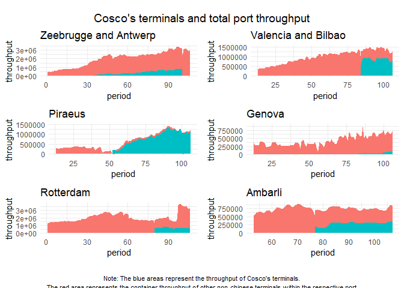
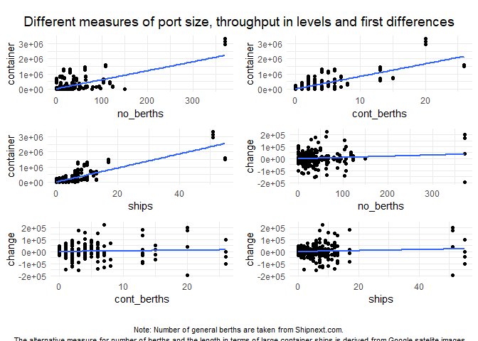
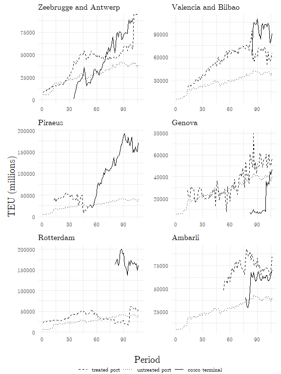

# Cosco terminal level robustness check

## Terminal-level Difference in Difference

In the previous estimations, we used port-level data to measure the effect of Chinese investments on port performance. While this approach allowed us to control for various confounding variables in the fixed effects approach and gave us a nearly exhaustive coverage for the difference in difference calculations, it also comes with a lack in precision. Most of the Chinese investments do not target the whole port, but just one operational unit (usually a terminal). Therefore, our results might be driven by other terminals, which are part of the respective port but are not owned by Chinese investors. Vice versa, potentially poor performance of non-chinese terminals might negatively affect the estimated treatment effect. To tackle this shortcoming, this robustness check explores the effect of Chinese investments using terminal-level throughput data. The terminal-level throughput data is published on the Cosco website and covers all investments terminals Cosco invested in overseas. (footnote: unfortunately, CMP and Hutison ports do not publish terminal-level throughput data. However, given that most of the significant effects were found for Cosco-controlled ports, this robustness check covers most of the relevant ports.) The graphs below display the terminal-level throughput reportet by Coscos in relation to the total throughput of the respective port as reported by Eurostat. (footnote: Zeebruegge and Antwerp, and Bilbao and Valencia had to be combined due to Cosco's reporting practice) Clearly, besides Piraeus, none of the ports are fully under controll of Cosco. In som cases, the throughput associated with Cosco's terminal only makes up a fraction of the total port throughput. 


<!-- -->


To pair Cosco's terminal-level data with our port-level data, we normalize the throughput by port size. Naturally, larger ports should have higher throughput and should have a higher capacity for growth. To make the port- and terminal-level data comparable, we consider the number of berths of each port (including berths used for passenger traffic), the number of berths that are predominantly used for container shippings, and the total number of container ships that can dock at containter terminal(s) (measured by quay length divided by 300m. For ports without quay length, the number of ships was guesstimated on google maps.). The graphs below illustrate how good each measure explains the container throughput of the ports in year 2020.  


<!-- -->

The graph above indicates that the length of the quay measured in container ship length best explains the port-level throughput. Therefore, we will normalize the terminal-level throughput of cosco-controlled terminals and the port-level throughput by the number of container ships that can dock at all container terminals. The graph below plots the normalized throughput figures for all six ports that have received Cosco investments. The solid lines represents the throughput per ship slot of the Cosco's terminals, the dashed line represents throughput per ship slot of all terminals in the treated port (excluding those taken over by Cosco). As an additional reference, we also plot the average throughput per ship scored by all non-treated ports (dotted line). 


<!-- -->

The table below contrasts the throughput per ship slot of Cosco's terminals with the average throughput per ship slot of european port. While for some ports this might be a reasonable controlgroup, for others, it is not. In particular Valencia and Bilbao, and Ambarli expierenced much stronger growth in the periods before the Chinese investment. Therefore, other controlgroups might be a sensible option: 

- use the remaining, non-chinese terminals in the treated port as control group. 
- use only a specific subsample of equally developed ports as control group.
- use ports that experienced a high than average growth rate as control group. 


```{=html}
<div id="biiflpykrx" style="padding-left:0px;padding-right:0px;padding-top:10px;padding-bottom:10px;overflow-x:auto;overflow-y:auto;width:auto;height:auto;">
<style>#biiflpykrx table {
  font-family: system-ui, 'Segoe UI', Roboto, Helvetica, Arial, sans-serif, 'Apple Color Emoji', 'Segoe UI Emoji', 'Segoe UI Symbol', 'Noto Color Emoji';
  -webkit-font-smoothing: antialiased;
  -moz-osx-font-smoothing: grayscale;
}

#biiflpykrx thead, #biiflpykrx tbody, #biiflpykrx tfoot, #biiflpykrx tr, #biiflpykrx td, #biiflpykrx th {
  border-style: none;
}

#biiflpykrx p {
  margin: 0;
  padding: 0;
}

#biiflpykrx .gt_table {
  display: table;
  border-collapse: collapse;
  line-height: normal;
  margin-left: auto;
  margin-right: auto;
  color: #333333;
  font-size: 16px;
  font-weight: normal;
  font-style: normal;
  background-color: #FFFFFF;
  width: auto;
  border-top-style: solid;
  border-top-width: 2px;
  border-top-color: #A8A8A8;
  border-right-style: none;
  border-right-width: 2px;
  border-right-color: #D3D3D3;
  border-bottom-style: solid;
  border-bottom-width: 2px;
  border-bottom-color: #A8A8A8;
  border-left-style: none;
  border-left-width: 2px;
  border-left-color: #D3D3D3;
}

#biiflpykrx .gt_caption {
  padding-top: 4px;
  padding-bottom: 4px;
}

#biiflpykrx .gt_title {
  color: #333333;
  font-size: 125%;
  font-weight: initial;
  padding-top: 4px;
  padding-bottom: 4px;
  padding-left: 5px;
  padding-right: 5px;
  border-bottom-color: #FFFFFF;
  border-bottom-width: 0;
}

#biiflpykrx .gt_subtitle {
  color: #333333;
  font-size: 85%;
  font-weight: initial;
  padding-top: 3px;
  padding-bottom: 5px;
  padding-left: 5px;
  padding-right: 5px;
  border-top-color: #FFFFFF;
  border-top-width: 0;
}

#biiflpykrx .gt_heading {
  background-color: #FFFFFF;
  text-align: center;
  border-bottom-color: #FFFFFF;
  border-left-style: none;
  border-left-width: 1px;
  border-left-color: #D3D3D3;
  border-right-style: none;
  border-right-width: 1px;
  border-right-color: #D3D3D3;
}

#biiflpykrx .gt_bottom_border {
  border-bottom-style: solid;
  border-bottom-width: 2px;
  border-bottom-color: #D3D3D3;
}

#biiflpykrx .gt_col_headings {
  border-top-style: solid;
  border-top-width: 2px;
  border-top-color: #D3D3D3;
  border-bottom-style: solid;
  border-bottom-width: 2px;
  border-bottom-color: #D3D3D3;
  border-left-style: none;
  border-left-width: 1px;
  border-left-color: #D3D3D3;
  border-right-style: none;
  border-right-width: 1px;
  border-right-color: #D3D3D3;
}

#biiflpykrx .gt_col_heading {
  color: #333333;
  background-color: #FFFFFF;
  font-size: 100%;
  font-weight: normal;
  text-transform: inherit;
  border-left-style: none;
  border-left-width: 1px;
  border-left-color: #D3D3D3;
  border-right-style: none;
  border-right-width: 1px;
  border-right-color: #D3D3D3;
  vertical-align: bottom;
  padding-top: 5px;
  padding-bottom: 6px;
  padding-left: 5px;
  padding-right: 5px;
  overflow-x: hidden;
}

#biiflpykrx .gt_column_spanner_outer {
  color: #333333;
  background-color: #FFFFFF;
  font-size: 100%;
  font-weight: normal;
  text-transform: inherit;
  padding-top: 0;
  padding-bottom: 0;
  padding-left: 4px;
  padding-right: 4px;
}

#biiflpykrx .gt_column_spanner_outer:first-child {
  padding-left: 0;
}

#biiflpykrx .gt_column_spanner_outer:last-child {
  padding-right: 0;
}

#biiflpykrx .gt_column_spanner {
  border-bottom-style: solid;
  border-bottom-width: 2px;
  border-bottom-color: #D3D3D3;
  vertical-align: bottom;
  padding-top: 5px;
  padding-bottom: 5px;
  overflow-x: hidden;
  display: inline-block;
  width: 100%;
}

#biiflpykrx .gt_spanner_row {
  border-bottom-style: hidden;
}

#biiflpykrx .gt_group_heading {
  padding-top: 8px;
  padding-bottom: 8px;
  padding-left: 5px;
  padding-right: 5px;
  color: #333333;
  background-color: #FFFFFF;
  font-size: 100%;
  font-weight: initial;
  text-transform: inherit;
  border-top-style: solid;
  border-top-width: 2px;
  border-top-color: #D3D3D3;
  border-bottom-style: solid;
  border-bottom-width: 2px;
  border-bottom-color: #D3D3D3;
  border-left-style: none;
  border-left-width: 1px;
  border-left-color: #D3D3D3;
  border-right-style: none;
  border-right-width: 1px;
  border-right-color: #D3D3D3;
  vertical-align: middle;
  text-align: left;
}

#biiflpykrx .gt_empty_group_heading {
  padding: 0.5px;
  color: #333333;
  background-color: #FFFFFF;
  font-size: 100%;
  font-weight: initial;
  border-top-style: solid;
  border-top-width: 2px;
  border-top-color: #D3D3D3;
  border-bottom-style: solid;
  border-bottom-width: 2px;
  border-bottom-color: #D3D3D3;
  vertical-align: middle;
}

#biiflpykrx .gt_from_md > :first-child {
  margin-top: 0;
}

#biiflpykrx .gt_from_md > :last-child {
  margin-bottom: 0;
}

#biiflpykrx .gt_row {
  padding-top: 8px;
  padding-bottom: 8px;
  padding-left: 5px;
  padding-right: 5px;
  margin: 10px;
  border-top-style: solid;
  border-top-width: 1px;
  border-top-color: #D3D3D3;
  border-left-style: none;
  border-left-width: 1px;
  border-left-color: #D3D3D3;
  border-right-style: none;
  border-right-width: 1px;
  border-right-color: #D3D3D3;
  vertical-align: middle;
  overflow-x: hidden;
}

#biiflpykrx .gt_stub {
  color: #333333;
  background-color: #FFFFFF;
  font-size: 100%;
  font-weight: initial;
  text-transform: inherit;
  border-right-style: solid;
  border-right-width: 2px;
  border-right-color: #D3D3D3;
  padding-left: 5px;
  padding-right: 5px;
}

#biiflpykrx .gt_stub_row_group {
  color: #333333;
  background-color: #FFFFFF;
  font-size: 100%;
  font-weight: initial;
  text-transform: inherit;
  border-right-style: solid;
  border-right-width: 2px;
  border-right-color: #D3D3D3;
  padding-left: 5px;
  padding-right: 5px;
  vertical-align: top;
}

#biiflpykrx .gt_row_group_first td {
  border-top-width: 2px;
}

#biiflpykrx .gt_row_group_first th {
  border-top-width: 2px;
}

#biiflpykrx .gt_summary_row {
  color: #333333;
  background-color: #FFFFFF;
  text-transform: inherit;
  padding-top: 8px;
  padding-bottom: 8px;
  padding-left: 5px;
  padding-right: 5px;
}

#biiflpykrx .gt_first_summary_row {
  border-top-style: solid;
  border-top-color: #D3D3D3;
}

#biiflpykrx .gt_first_summary_row.thick {
  border-top-width: 2px;
}

#biiflpykrx .gt_last_summary_row {
  padding-top: 8px;
  padding-bottom: 8px;
  padding-left: 5px;
  padding-right: 5px;
  border-bottom-style: solid;
  border-bottom-width: 2px;
  border-bottom-color: #D3D3D3;
}

#biiflpykrx .gt_grand_summary_row {
  color: #333333;
  background-color: #FFFFFF;
  text-transform: inherit;
  padding-top: 8px;
  padding-bottom: 8px;
  padding-left: 5px;
  padding-right: 5px;
}

#biiflpykrx .gt_first_grand_summary_row {
  padding-top: 8px;
  padding-bottom: 8px;
  padding-left: 5px;
  padding-right: 5px;
  border-top-style: double;
  border-top-width: 6px;
  border-top-color: #D3D3D3;
}

#biiflpykrx .gt_last_grand_summary_row_top {
  padding-top: 8px;
  padding-bottom: 8px;
  padding-left: 5px;
  padding-right: 5px;
  border-bottom-style: double;
  border-bottom-width: 6px;
  border-bottom-color: #D3D3D3;
}

#biiflpykrx .gt_striped {
  background-color: rgba(128, 128, 128, 0.05);
}

#biiflpykrx .gt_table_body {
  border-top-style: solid;
  border-top-width: 2px;
  border-top-color: #D3D3D3;
  border-bottom-style: solid;
  border-bottom-width: 2px;
  border-bottom-color: #D3D3D3;
}

#biiflpykrx .gt_footnotes {
  color: #333333;
  background-color: #FFFFFF;
  border-bottom-style: none;
  border-bottom-width: 2px;
  border-bottom-color: #D3D3D3;
  border-left-style: none;
  border-left-width: 2px;
  border-left-color: #D3D3D3;
  border-right-style: none;
  border-right-width: 2px;
  border-right-color: #D3D3D3;
}

#biiflpykrx .gt_footnote {
  margin: 0px;
  font-size: 90%;
  padding-top: 4px;
  padding-bottom: 4px;
  padding-left: 5px;
  padding-right: 5px;
}

#biiflpykrx .gt_sourcenotes {
  color: #333333;
  background-color: #FFFFFF;
  border-bottom-style: none;
  border-bottom-width: 2px;
  border-bottom-color: #D3D3D3;
  border-left-style: none;
  border-left-width: 2px;
  border-left-color: #D3D3D3;
  border-right-style: none;
  border-right-width: 2px;
  border-right-color: #D3D3D3;
}

#biiflpykrx .gt_sourcenote {
  font-size: 90%;
  padding-top: 4px;
  padding-bottom: 4px;
  padding-left: 5px;
  padding-right: 5px;
}

#biiflpykrx .gt_left {
  text-align: left;
}

#biiflpykrx .gt_center {
  text-align: center;
}

#biiflpykrx .gt_right {
  text-align: right;
  font-variant-numeric: tabular-nums;
}

#biiflpykrx .gt_font_normal {
  font-weight: normal;
}

#biiflpykrx .gt_font_bold {
  font-weight: bold;
}

#biiflpykrx .gt_font_italic {
  font-style: italic;
}

#biiflpykrx .gt_super {
  font-size: 65%;
}

#biiflpykrx .gt_footnote_marks {
  font-size: 75%;
  vertical-align: 0.4em;
  position: initial;
}

#biiflpykrx .gt_asterisk {
  font-size: 100%;
  vertical-align: 0;
}

#biiflpykrx .gt_indent_1 {
  text-indent: 5px;
}

#biiflpykrx .gt_indent_2 {
  text-indent: 10px;
}

#biiflpykrx .gt_indent_3 {
  text-indent: 15px;
}

#biiflpykrx .gt_indent_4 {
  text-indent: 20px;
}

#biiflpykrx .gt_indent_5 {
  text-indent: 25px;
}
</style>
<table class="gt_table" data-quarto-disable-processing="false" data-quarto-bootstrap="false">
  <thead>
    <tr class="gt_heading">
      <td colspan="2" class="gt_heading gt_title gt_font_normal" style>Aggregation of group time average treatment effects</td>
    </tr>
    <tr class="gt_heading">
      <td colspan="2" class="gt_heading gt_subtitle gt_font_normal gt_bottom_border" style>Control group: Never treated</td>
    </tr>
    <tr class="gt_col_headings">
      <th class="gt_col_heading gt_columns_bottom_border gt_left" rowspan="1" colspan="1" scope="col" id=""></th>
      <th class="gt_col_heading gt_columns_bottom_border gt_right" rowspan="1" colspan="1" scope="col" id="ATT">ATT</th>
    </tr>
  </thead>
  <tbody class="gt_table_body">
    <tr class="gt_group_heading_row">
      <th colspan="2" class="gt_empty_group_heading" scope="colgroup" id=""></th>
    </tr>
    <tr class="gt_row_group_first"><th id="stub_1_1" scope="row" class="gt_row gt_left gt_stub">simple average</th>
<td headers="NA stub_1_1 est" class="gt_row gt_right">38,434**</td></tr>
    <tr><th id="stub_1_2" scope="row" class="gt_row gt_left gt_stub"></th>
<td headers="NA stub_1_2 est" class="gt_row gt_right">(13,421)</td></tr>
    <tr class="gt_group_heading_row">
      <th colspan="2" class="gt_group_heading" scope="colgroup" id="by group:">by group:</th>
    </tr>
    <tr class="gt_row_group_first"><th id="stub_1_3" scope="row" class="gt_row gt_left gt_stub">Zeebrugge and Antwerp (36)</th>
<td headers="by group: stub_1_3 est" class="gt_row gt_right">37,149***</td></tr>
    <tr><th id="stub_1_4" scope="row" class="gt_row gt_left gt_stub"></th>
<td headers="by group: stub_1_4 est" class="gt_row gt_right">(1,806)</td></tr>
    <tr><th id="stub_1_5" scope="row" class="gt_row gt_left gt_stub">Piraeus (53)</th>
<td headers="by group: stub_1_5 est" class="gt_row gt_right">86,165***</td></tr>
    <tr><th id="stub_1_6" scope="row" class="gt_row gt_left gt_stub"></th>
<td headers="by group: stub_1_6 est" class="gt_row gt_right">(2,507)</td></tr>
    <tr><th id="stub_1_7" scope="row" class="gt_row gt_left gt_stub">Ambarli (78)</th>
<td headers="by group: stub_1_7 est" class="gt_row gt_right">14,209***</td></tr>
    <tr><th id="stub_1_8" scope="row" class="gt_row gt_left gt_stub"></th>
<td headers="by group: stub_1_8 est" class="gt_row gt_right">(2,030)</td></tr>
    <tr><th id="stub_1_9" scope="row" class="gt_row gt_left gt_stub">Rotterdam (81)</th>
<td headers="by group: stub_1_9 est" class="gt_row gt_right"> 1,209</td></tr>
    <tr><th id="stub_1_10" scope="row" class="gt_row gt_left gt_stub"></th>
<td headers="by group: stub_1_10 est" class="gt_row gt_right">(2,723)</td></tr>
    <tr><th id="stub_1_11" scope="row" class="gt_row gt_left gt_stub">Genova (83)</th>
<td headers="by group: stub_1_11 est" class="gt_row gt_right"> 8,421***</td></tr>
    <tr><th id="stub_1_12" scope="row" class="gt_row gt_left gt_stub"></th>
<td headers="by group: stub_1_12 est" class="gt_row gt_right">(2,310)</td></tr>
    <tr><th id="stub_1_13" scope="row" class="gt_row gt_left gt_stub">Valencia and Bilbao (85)</th>
<td headers="by group: stub_1_13 est" class="gt_row gt_right">34,842***</td></tr>
    <tr><th id="stub_1_14" scope="row" class="gt_row gt_left gt_stub"></th>
<td headers="by group: stub_1_14 est" class="gt_row gt_right">(2,222)</td></tr>
  </tbody>
  
  <tfoot class="gt_footnotes">
    <tr>
      <td class="gt_footnote" colspan="2"> Signif. Codes: ***: 0.001, **: 0.01, *: 0.05.</td>
    </tr>
    <tr>
      <td class="gt_footnote" colspan="2"> Analytical standard errors in parentheses.</td>
    </tr>
  </tfoot>
</table>
</div>
```

The main disadvantage of this robustness check is that it cannot provide any indication of the validity of the PTA, since there is no terminal-level data before the Chinese investment available. To circumvent this, the first period of the treatment is used as the untreated throughput of each treated terminal. This assumption might be reasonable, considering that it is unlikely to see stark changes in infrastructure and management just one quarter after the take-over. On the other side, some might argue that the first period might a unfitting comparison, as ther port needs some adjustment time to the management change. This would cause an upward bias in the results. Additionally, in some cases, it appears likely that the investment targeted a more productive terminal of the port, which would result in an selection bias. To counteract this, either more information on port equipment (cranes or storage) could be used to construct counterfactuals. 

## The role of Chinese Containers

The previous analysis has shown that ports controlled by Chinese investors outperform other comparable European ports. One possible explanation is, that Chinese owned ports are the preferred destination of the Chinese container ships. That fits well with the literature on (add cosco line paper, maybe investment selection? Ports owned by a chinese company with a own fleet grow more that others. Media reports on "foot in the door strategy"). In this extension, we look into how much of the port growth after Chinese investment is indeed caused by more container arriving from China. To investigate this question, we return to the bilateral port-level data from Eurostat and estimate two additional DiD. In the first, we again aggregate the container throughput on port-quarter level but exclude all container traffic with China Mainland and Hong Kong. In the second, we use the share of chinese containers relative to containers from other origins in each port as dependent variable. In the latter case, the identifying parallel trends assumption that needs to hold is that the relative throughput of Chinese containers in treated ports trend in the same way as the relative throughput of Chinese containers in untreated ports @Olden.2022. (footnote: This setup has a number of advantages over a simple difference in difference using Chinese container throughput in levels as the outcome variable. In particular, the triple difference setup helps reducing potential bias that could be in a difference in difference estimation of Chinese container throughput versus container throughput of other origins for treated ports and untreated ports.) With the help of these two setups, we can infer whether the growth in throughput has been carried primarily by Chinese container shipments and whether that growth came at the expense of container shipments from other origins. 


```{=html}
<div id="hurwdhtojn" style="padding-left:0px;padding-right:0px;padding-top:10px;padding-bottom:10px;overflow-x:auto;overflow-y:auto;width:auto;height:auto;">
<style>#hurwdhtojn table {
  font-family: system-ui, 'Segoe UI', Roboto, Helvetica, Arial, sans-serif, 'Apple Color Emoji', 'Segoe UI Emoji', 'Segoe UI Symbol', 'Noto Color Emoji';
  -webkit-font-smoothing: antialiased;
  -moz-osx-font-smoothing: grayscale;
}

#hurwdhtojn thead, #hurwdhtojn tbody, #hurwdhtojn tfoot, #hurwdhtojn tr, #hurwdhtojn td, #hurwdhtojn th {
  border-style: none;
}

#hurwdhtojn p {
  margin: 0;
  padding: 0;
}

#hurwdhtojn .gt_table {
  display: table;
  border-collapse: collapse;
  line-height: normal;
  margin-left: auto;
  margin-right: auto;
  color: #333333;
  font-size: 16px;
  font-weight: normal;
  font-style: normal;
  background-color: #FFFFFF;
  width: auto;
  border-top-style: solid;
  border-top-width: 2px;
  border-top-color: #A8A8A8;
  border-right-style: none;
  border-right-width: 2px;
  border-right-color: #D3D3D3;
  border-bottom-style: solid;
  border-bottom-width: 2px;
  border-bottom-color: #A8A8A8;
  border-left-style: none;
  border-left-width: 2px;
  border-left-color: #D3D3D3;
}

#hurwdhtojn .gt_caption {
  padding-top: 4px;
  padding-bottom: 4px;
}

#hurwdhtojn .gt_title {
  color: #333333;
  font-size: 125%;
  font-weight: initial;
  padding-top: 4px;
  padding-bottom: 4px;
  padding-left: 5px;
  padding-right: 5px;
  border-bottom-color: #FFFFFF;
  border-bottom-width: 0;
}

#hurwdhtojn .gt_subtitle {
  color: #333333;
  font-size: 85%;
  font-weight: initial;
  padding-top: 3px;
  padding-bottom: 5px;
  padding-left: 5px;
  padding-right: 5px;
  border-top-color: #FFFFFF;
  border-top-width: 0;
}

#hurwdhtojn .gt_heading {
  background-color: #FFFFFF;
  text-align: center;
  border-bottom-color: #FFFFFF;
  border-left-style: none;
  border-left-width: 1px;
  border-left-color: #D3D3D3;
  border-right-style: none;
  border-right-width: 1px;
  border-right-color: #D3D3D3;
}

#hurwdhtojn .gt_bottom_border {
  border-bottom-style: solid;
  border-bottom-width: 2px;
  border-bottom-color: #D3D3D3;
}

#hurwdhtojn .gt_col_headings {
  border-top-style: solid;
  border-top-width: 2px;
  border-top-color: #D3D3D3;
  border-bottom-style: solid;
  border-bottom-width: 2px;
  border-bottom-color: #D3D3D3;
  border-left-style: none;
  border-left-width: 1px;
  border-left-color: #D3D3D3;
  border-right-style: none;
  border-right-width: 1px;
  border-right-color: #D3D3D3;
}

#hurwdhtojn .gt_col_heading {
  color: #333333;
  background-color: #FFFFFF;
  font-size: 100%;
  font-weight: normal;
  text-transform: inherit;
  border-left-style: none;
  border-left-width: 1px;
  border-left-color: #D3D3D3;
  border-right-style: none;
  border-right-width: 1px;
  border-right-color: #D3D3D3;
  vertical-align: bottom;
  padding-top: 5px;
  padding-bottom: 6px;
  padding-left: 5px;
  padding-right: 5px;
  overflow-x: hidden;
}

#hurwdhtojn .gt_column_spanner_outer {
  color: #333333;
  background-color: #FFFFFF;
  font-size: 100%;
  font-weight: normal;
  text-transform: inherit;
  padding-top: 0;
  padding-bottom: 0;
  padding-left: 4px;
  padding-right: 4px;
}

#hurwdhtojn .gt_column_spanner_outer:first-child {
  padding-left: 0;
}

#hurwdhtojn .gt_column_spanner_outer:last-child {
  padding-right: 0;
}

#hurwdhtojn .gt_column_spanner {
  border-bottom-style: solid;
  border-bottom-width: 2px;
  border-bottom-color: #D3D3D3;
  vertical-align: bottom;
  padding-top: 5px;
  padding-bottom: 5px;
  overflow-x: hidden;
  display: inline-block;
  width: 100%;
}

#hurwdhtojn .gt_spanner_row {
  border-bottom-style: hidden;
}

#hurwdhtojn .gt_group_heading {
  padding-top: 8px;
  padding-bottom: 8px;
  padding-left: 5px;
  padding-right: 5px;
  color: #333333;
  background-color: #FFFFFF;
  font-size: 100%;
  font-weight: initial;
  text-transform: inherit;
  border-top-style: solid;
  border-top-width: 2px;
  border-top-color: #D3D3D3;
  border-bottom-style: solid;
  border-bottom-width: 2px;
  border-bottom-color: #D3D3D3;
  border-left-style: none;
  border-left-width: 1px;
  border-left-color: #D3D3D3;
  border-right-style: none;
  border-right-width: 1px;
  border-right-color: #D3D3D3;
  vertical-align: middle;
  text-align: left;
}

#hurwdhtojn .gt_empty_group_heading {
  padding: 0.5px;
  color: #333333;
  background-color: #FFFFFF;
  font-size: 100%;
  font-weight: initial;
  border-top-style: solid;
  border-top-width: 2px;
  border-top-color: #D3D3D3;
  border-bottom-style: solid;
  border-bottom-width: 2px;
  border-bottom-color: #D3D3D3;
  vertical-align: middle;
}

#hurwdhtojn .gt_from_md > :first-child {
  margin-top: 0;
}

#hurwdhtojn .gt_from_md > :last-child {
  margin-bottom: 0;
}

#hurwdhtojn .gt_row {
  padding-top: 8px;
  padding-bottom: 8px;
  padding-left: 5px;
  padding-right: 5px;
  margin: 10px;
  border-top-style: solid;
  border-top-width: 1px;
  border-top-color: #D3D3D3;
  border-left-style: none;
  border-left-width: 1px;
  border-left-color: #D3D3D3;
  border-right-style: none;
  border-right-width: 1px;
  border-right-color: #D3D3D3;
  vertical-align: middle;
  overflow-x: hidden;
}

#hurwdhtojn .gt_stub {
  color: #333333;
  background-color: #FFFFFF;
  font-size: 100%;
  font-weight: initial;
  text-transform: inherit;
  border-right-style: solid;
  border-right-width: 2px;
  border-right-color: #D3D3D3;
  padding-left: 5px;
  padding-right: 5px;
}

#hurwdhtojn .gt_stub_row_group {
  color: #333333;
  background-color: #FFFFFF;
  font-size: 100%;
  font-weight: initial;
  text-transform: inherit;
  border-right-style: solid;
  border-right-width: 2px;
  border-right-color: #D3D3D3;
  padding-left: 5px;
  padding-right: 5px;
  vertical-align: top;
}

#hurwdhtojn .gt_row_group_first td {
  border-top-width: 2px;
}

#hurwdhtojn .gt_row_group_first th {
  border-top-width: 2px;
}

#hurwdhtojn .gt_summary_row {
  color: #333333;
  background-color: #FFFFFF;
  text-transform: inherit;
  padding-top: 8px;
  padding-bottom: 8px;
  padding-left: 5px;
  padding-right: 5px;
}

#hurwdhtojn .gt_first_summary_row {
  border-top-style: solid;
  border-top-color: #D3D3D3;
}

#hurwdhtojn .gt_first_summary_row.thick {
  border-top-width: 2px;
}

#hurwdhtojn .gt_last_summary_row {
  padding-top: 8px;
  padding-bottom: 8px;
  padding-left: 5px;
  padding-right: 5px;
  border-bottom-style: solid;
  border-bottom-width: 2px;
  border-bottom-color: #D3D3D3;
}

#hurwdhtojn .gt_grand_summary_row {
  color: #333333;
  background-color: #FFFFFF;
  text-transform: inherit;
  padding-top: 8px;
  padding-bottom: 8px;
  padding-left: 5px;
  padding-right: 5px;
}

#hurwdhtojn .gt_first_grand_summary_row {
  padding-top: 8px;
  padding-bottom: 8px;
  padding-left: 5px;
  padding-right: 5px;
  border-top-style: double;
  border-top-width: 6px;
  border-top-color: #D3D3D3;
}

#hurwdhtojn .gt_last_grand_summary_row_top {
  padding-top: 8px;
  padding-bottom: 8px;
  padding-left: 5px;
  padding-right: 5px;
  border-bottom-style: double;
  border-bottom-width: 6px;
  border-bottom-color: #D3D3D3;
}

#hurwdhtojn .gt_striped {
  background-color: rgba(128, 128, 128, 0.05);
}

#hurwdhtojn .gt_table_body {
  border-top-style: solid;
  border-top-width: 2px;
  border-top-color: #D3D3D3;
  border-bottom-style: solid;
  border-bottom-width: 2px;
  border-bottom-color: #D3D3D3;
}

#hurwdhtojn .gt_footnotes {
  color: #333333;
  background-color: #FFFFFF;
  border-bottom-style: none;
  border-bottom-width: 2px;
  border-bottom-color: #D3D3D3;
  border-left-style: none;
  border-left-width: 2px;
  border-left-color: #D3D3D3;
  border-right-style: none;
  border-right-width: 2px;
  border-right-color: #D3D3D3;
}

#hurwdhtojn .gt_footnote {
  margin: 0px;
  font-size: 90%;
  padding-top: 4px;
  padding-bottom: 4px;
  padding-left: 5px;
  padding-right: 5px;
}

#hurwdhtojn .gt_sourcenotes {
  color: #333333;
  background-color: #FFFFFF;
  border-bottom-style: none;
  border-bottom-width: 2px;
  border-bottom-color: #D3D3D3;
  border-left-style: none;
  border-left-width: 2px;
  border-left-color: #D3D3D3;
  border-right-style: none;
  border-right-width: 2px;
  border-right-color: #D3D3D3;
}

#hurwdhtojn .gt_sourcenote {
  font-size: 90%;
  padding-top: 4px;
  padding-bottom: 4px;
  padding-left: 5px;
  padding-right: 5px;
}

#hurwdhtojn .gt_left {
  text-align: left;
}

#hurwdhtojn .gt_center {
  text-align: center;
}

#hurwdhtojn .gt_right {
  text-align: right;
  font-variant-numeric: tabular-nums;
}

#hurwdhtojn .gt_font_normal {
  font-weight: normal;
}

#hurwdhtojn .gt_font_bold {
  font-weight: bold;
}

#hurwdhtojn .gt_font_italic {
  font-style: italic;
}

#hurwdhtojn .gt_super {
  font-size: 65%;
}

#hurwdhtojn .gt_footnote_marks {
  font-size: 75%;
  vertical-align: 0.4em;
  position: initial;
}

#hurwdhtojn .gt_asterisk {
  font-size: 100%;
  vertical-align: 0;
}

#hurwdhtojn .gt_indent_1 {
  text-indent: 5px;
}

#hurwdhtojn .gt_indent_2 {
  text-indent: 10px;
}

#hurwdhtojn .gt_indent_3 {
  text-indent: 15px;
}

#hurwdhtojn .gt_indent_4 {
  text-indent: 20px;
}

#hurwdhtojn .gt_indent_5 {
  text-indent: 25px;
}
</style>
<table class="gt_table" data-quarto-disable-processing="false" data-quarto-bootstrap="false">
  <thead>
    <tr class="gt_heading">
      <td colspan="3" class="gt_heading gt_title gt_font_normal" style>Aggregated average treatment effects on container throughput from different origins</td>
    </tr>
    <tr class="gt_heading">
      <td colspan="3" class="gt_heading gt_subtitle gt_font_normal gt_bottom_border" style>Control group: Never treated, PTA: Unconditional</td>
    </tr>
    <tr class="gt_col_headings">
      <th class="gt_col_heading gt_columns_bottom_border gt_left" rowspan="1" colspan="1" scope="col" id="Dependent variable:">Dependent variable:</th>
      <th class="gt_col_heading gt_columns_bottom_border gt_right" rowspan="1" colspan="1" scope="col" id="TEU without China">TEU without China</th>
      <th class="gt_col_heading gt_columns_bottom_border gt_right" rowspan="1" colspan="1" scope="col" id="Share of chinese TEU">Share of chinese TEU</th>
    </tr>
  </thead>
  <tbody class="gt_table_body">
    <tr class="gt_group_heading_row">
      <th colspan="3" class="gt_empty_group_heading" scope="colgroup" id=""></th>
    </tr>
    <tr class="gt_row_group_first"><th id="stub_1_1" scope="row" class="gt_row gt_left gt_stub">simple average</th>
<td headers="NA stub_1_1 est.x" class="gt_row gt_right">159,926*</td>
<td headers="NA stub_1_1 est.y" class="gt_row gt_right"> 0.0060</td></tr>
    <tr><th id="stub_1_2" scope="row" class="gt_row gt_left gt_stub"></th>
<td headers="NA stub_1_2 est.x" class="gt_row gt_right">(70,933)</td>
<td headers="NA stub_1_2 est.y" class="gt_row gt_right">(0.0136)</td></tr>
    <tr class="gt_group_heading_row">
      <th colspan="3" class="gt_group_heading" scope="colgroup" id="by group:">by group:</th>
    </tr>
    <tr class="gt_row_group_first"><th id="stub_1_3" scope="row" class="gt_row gt_left gt_stub">Ambarli (76)</th>
<td headers="by group: stub_1_3 est.x" class="gt_row gt_right">-23,060**</td>
<td headers="by group: stub_1_3 est.y" class="gt_row gt_right">-0.0242***</td></tr>
    <tr><th id="stub_1_4" scope="row" class="gt_row gt_left gt_stub"></th>
<td headers="by group: stub_1_4 est.x" class="gt_row gt_right">(7,371)</td>
<td headers="by group: stub_1_4 est.y" class="gt_row gt_right">(0.0048)</td></tr>
    <tr><th id="stub_1_5" scope="row" class="gt_row gt_left gt_stub">Amsterdam, Thessaloniki (85)</th>
<td headers="by group: stub_1_5 est.x" class="gt_row gt_right"> -4,058</td>
<td headers="by group: stub_1_5 est.y" class="gt_row gt_right"> 0.0047</td></tr>
    <tr><th id="stub_1_6" scope="row" class="gt_row gt_left gt_stub"></th>
<td headers="by group: stub_1_6 est.x" class="gt_row gt_right">(11,776)</td>
<td headers="by group: stub_1_6 est.y" class="gt_row gt_right">(0.0044)</td></tr>
    <tr><th id="stub_1_7" scope="row" class="gt_row gt_left gt_stub">Antwerpen (32)</th>
<td headers="by group: stub_1_7 est.x" class="gt_row gt_right">774,003***</td>
<td headers="by group: stub_1_7 est.y" class="gt_row gt_right">-0.0052</td></tr>
    <tr><th id="stub_1_8" scope="row" class="gt_row gt_left gt_stub"></th>
<td headers="by group: stub_1_8 est.x" class="gt_row gt_right">(5,522)</td>
<td headers="by group: stub_1_8 est.y" class="gt_row gt_right">(0.0060)</td></tr>
    <tr><th id="stub_1_9" scope="row" class="gt_row gt_left gt_stub">Barcelona (63)</th>
<td headers="by group: stub_1_9 est.x" class="gt_row gt_right">164,129***</td>
<td headers="by group: stub_1_9 est.y" class="gt_row gt_right"> 0.0124**</td></tr>
    <tr><th id="stub_1_10" scope="row" class="gt_row gt_left gt_stub"></th>
<td headers="by group: stub_1_10 est.x" class="gt_row gt_right">(6,634)</td>
<td headers="by group: stub_1_10 est.y" class="gt_row gt_right">(0.0039)</td></tr>
    <tr><th id="stub_1_11" scope="row" class="gt_row gt_left gt_stub">Bilbao, Valencia (84)</th>
<td headers="by group: stub_1_11 est.x" class="gt_row gt_right"> 21,219</td>
<td headers="by group: stub_1_11 est.y" class="gt_row gt_right">-0.0171</td></tr>
    <tr><th id="stub_1_12" scope="row" class="gt_row gt_left gt_stub"></th>
<td headers="by group: stub_1_12 est.x" class="gt_row gt_right">(31,467)</td>
<td headers="by group: stub_1_12 est.y" class="gt_row gt_right">(0.0129)</td></tr>
    <tr><th id="stub_1_13" scope="row" class="gt_row gt_left gt_stub">Dunkerque, Le Havre, Marsaxlokk, Marseille, Nantes Saint Nazaire, Zeebrugge (66)</th>
<td headers="by group: stub_1_13 est.x" class="gt_row gt_right">  5,376</td>
<td headers="by group: stub_1_13 est.y" class="gt_row gt_right">-0.0169</td></tr>
    <tr><th id="stub_1_14" scope="row" class="gt_row gt_left gt_stub"></th>
<td headers="by group: stub_1_14 est.x" class="gt_row gt_right">(22,259)</td>
<td headers="by group: stub_1_14 est.y" class="gt_row gt_right">(0.0354)</td></tr>
    <tr><th id="stub_1_15" scope="row" class="gt_row gt_left gt_stub">Gdynia (38)</th>
<td headers="by group: stub_1_15 est.x" class="gt_row gt_right"> 43,001***</td>
<td headers="by group: stub_1_15 est.y" class="gt_row gt_right">-0.0025</td></tr>
    <tr><th id="stub_1_16" scope="row" class="gt_row gt_left gt_stub"></th>
<td headers="by group: stub_1_16 est.x" class="gt_row gt_right">(5,825)</td>
<td headers="by group: stub_1_16 est.y" class="gt_row gt_right">(0.0058)</td></tr>
    <tr><th id="stub_1_17" scope="row" class="gt_row gt_left gt_stub">Genova (81)</th>
<td headers="by group: stub_1_17 est.x" class="gt_row gt_right">  5,897</td>
<td headers="by group: stub_1_17 est.y" class="gt_row gt_right"> 0.0712***</td></tr>
    <tr><th id="stub_1_18" scope="row" class="gt_row gt_left gt_stub"></th>
<td headers="by group: stub_1_18 est.x" class="gt_row gt_right">(8,016)</td>
<td headers="by group: stub_1_18 est.y" class="gt_row gt_right">(0.0040)</td></tr>
    <tr><th id="stub_1_19" scope="row" class="gt_row gt_left gt_stub">Moerdijk, Rotterdam (21)</th>
<td headers="by group: stub_1_19 est.x" class="gt_row gt_right">198,294</td>
<td headers="by group: stub_1_19 est.y" class="gt_row gt_right"> 0.0271</td></tr>
    <tr><th id="stub_1_20" scope="row" class="gt_row gt_left gt_stub"></th>
<td headers="by group: stub_1_20 est.x" class="gt_row gt_right">(137,696)</td>
<td headers="by group: stub_1_20 est.y" class="gt_row gt_right">(0.0584)</td></tr>
    <tr><th id="stub_1_21" scope="row" class="gt_row gt_left gt_stub">Piraeus (52)</th>
<td headers="by group: stub_1_21 est.x" class="gt_row gt_right">530,619***</td>
<td headers="by group: stub_1_21 est.y" class="gt_row gt_right"> 0.0685***</td></tr>
    <tr><th id="stub_1_22" scope="row" class="gt_row gt_left gt_stub"></th>
<td headers="by group: stub_1_22 est.x" class="gt_row gt_right">(7,292)</td>
<td headers="by group: stub_1_22 est.y" class="gt_row gt_right">(0.0095)</td></tr>
  </tbody>
  
  <tfoot class="gt_footnotes">
    <tr>
      <td class="gt_footnote" colspan="3"> Signif. Codes: ***: 0.001, **: 0.01, *: 0.05.</td>
    </tr>
    <tr>
      <td class="gt_footnote" colspan="3"> Analytical standard errors in parentheses.</td>
    </tr>
  </tfoot>
</table>
</div>
```

# References
